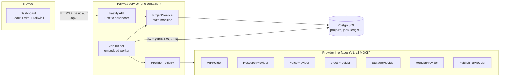
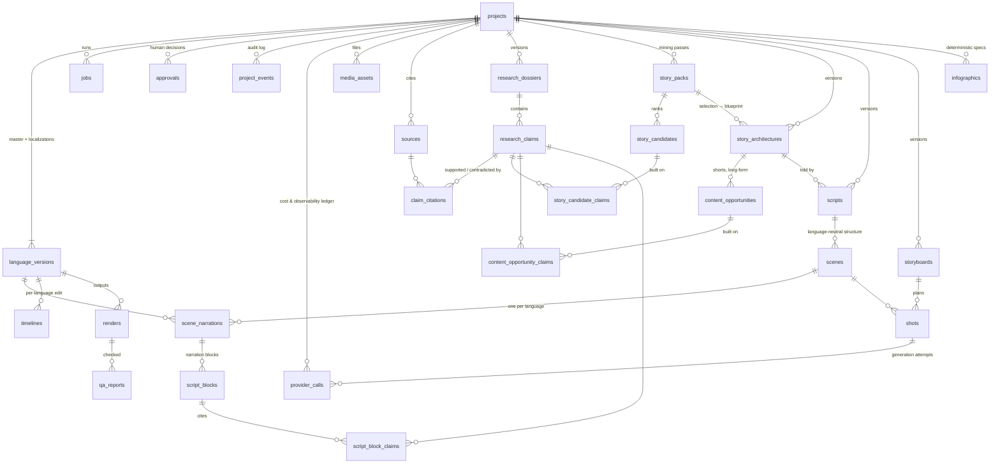
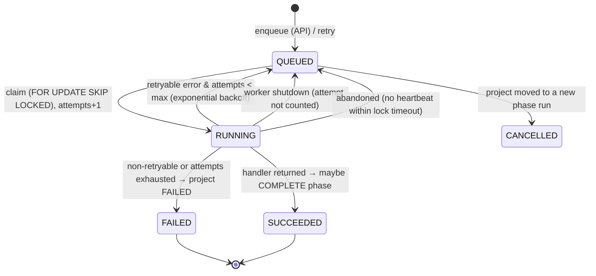

# Architecture — Documentary Engine V1

> Status: **milestone 2 (research engine)** on top of milestone 1
> (architecture & scaffold). What is real, mocked and
> planned is tracked in [STATUS.md](STATUS.md). Deployment is in
> [DEPLOYMENT.md](DEPLOYMENT.md).

## 1. Principles

1. **A modular monolith, not microservices.** One deployable (API + dashboard +
   embedded worker), one PostgreSQL database. Stages are isolated behind
   interfaces so any of them can later run as its own worker without a rewrite.
2. **The pipeline is data.** Every project status, which jobs run in it, which
   human gate guards it and where it goes next is declared once
   ([`packages/core/src/pipeline.ts`](../packages/core/src/pipeline.ts)).
   Transition rules, the dashboard stage view and the "what can I do next"
   actions are all *derived* from that table.
3. **Vendors are replaceable.** The app depends on seven provider interfaces,
   never on ElevenLabs/Higgsfield/etc. directly. A registry picks the
   implementation from environment variables.
4. **Mock mode is honest.** Everything runs without credentials, and every mock
   output is labelled `MOCK`. Mocks never claim success they did not have: a
   mock publish returns `published: false`, mock research returns URLs on the
   unresolvable `.invalid` domain, the mock LLM refuses to invent structured
   data.
5. **Humans approve.** Five review points (research, script, storyboard,
   generated visuals, final video) cannot be skipped by the state machine.
6. **Multilingual from day one.** A project has a master language and
   `LanguageVersion`s; the schema separates what is shared across languages
   from what is per language.

## 2. System overview



Request path: the dashboard calls the API; the API validates input (zod) and
calls `ProjectService`, which changes state inside a transaction that locks the
project row. Enqueued jobs are rows in `jobs`; the runner claims them, executes
the stage handler with a `StageContext`, records provider calls in the ledger
and reports success/failure back to `ProjectService`, which advances the
project when a phase completes.

## 3. Repository layout and dependency rules

```
apps/
  api/        Fastify server, composition root, worker & seed entry points, esbuild bundle
  web/        Dashboard shell (React 19, Vite 8, Tailwind 4, TanStack Query, React Router 7)
packages/
  core/       Domain: enums, pipeline/state machine, stage derivation, zod contracts, cost math. Browser-safe, no I/O.
  database/   Prisma 7 schema, migrations, client factory, test helpers
  providers/  Provider interfaces, MOCK implementations, registry, reusable contract test suites
  pipeline/   ProjectService (state changes), JobQueue, JobRunner, StageContext, stage handler contract, MOCK stage handlers
modules/      Real stage implementations: research (M2), story (M3: mining + architecture, revisions, angles), script (Script Engine 1.0); later voice, visual-director, infographics, editor, qa
docs/         Architecture, deployment, status
scripts/      release.sh (migrations + seed), test DB init
test/         Shared integration-test setup
```

Allowed dependencies (enforced by package.json declarations):

```
web ─────────────► core
api ──► pipeline ──► providers ──► core
          │  └─────► database  ──► core
          └────────► core
```

`core` imports nothing internal and nothing Node-specific, so the dashboard
shares the exact enums, labels, contracts and response types the API uses.
Only `apps/api/src/container.ts` chooses concrete implementations.

**Why a `pipeline` package rather than one package per stage now?** The stage
*logic* does not exist yet. Each real stage will become `modules/<stage>`
exporting a `StageHandler`, registered in `container.ts` in place of its mock.
Creating eight empty packages today would be ceremony without content.

## 4. Pipeline and state machine

The project `status` is the master pipeline phase (linear, as in the brief,
plus two added review statuses — see §16, D5–D6). Dashboard stages are derived.

| Status | Dashboard stage | Jobs that run here | Leaves by |
|---|---|---|---|
| IDEA | Research (not started) | — | START → RESEARCHING (enqueue RESEARCH) |
| RESEARCHING | Research | RESEARCH | all jobs done → RESEARCH_REVIEW |
| RESEARCH_REVIEW | Research (awaiting approval) | — | **gate RESEARCH**: approve → RESEARCH_COMPLETE, reject → RESEARCHING |
| RESEARCH_COMPLETE | Research ✓ | — | START → STORY_MINING |
| STORY_MINING | Story | STORY_MINING | → STORY_SELECTION |
| STORY_SELECTION | Story (editor curates candidates) | — | START → STORY_ARCHITECTING (enqueue STORY_ARCHITECTURE; needs 5–10 selected units) |
| STORY_ARCHITECTING | Story | STORY_ARCHITECTURE | → STORY_REVIEW |
| STORY_REVIEW | Story (awaiting approval) | — | **gate STORY**: approve → STORY_APPROVED, reject → STORY_SELECTION |
| STORY_APPROVED | Story ✓ | — | START → SCRIPT_DRAFT (never automatic) |
| SCRIPT_DRAFT | Script | SCRIPT | → SCRIPT_REVIEW |
| SCRIPT_REVIEW | Script (awaiting approval) | — | **gate SCRIPT**: approve → SCRIPT_APPROVED, reject → SCRIPT_DRAFT |
| SCRIPT_APPROVED | Script ✓ | — | START → VOICE_GENERATING |
| VOICE_GENERATING | Voice | VOICE | → VOICE_COMPLETE |
| VOICE_COMPLETE | Voice ✓ | — | START → VISUAL_PLANNING |
| VISUAL_PLANNING | Storyboard | VISUAL_PLAN | → STORYBOARD_REVIEW |
| STORYBOARD_REVIEW | Storyboard (awaiting approval) | — | **gate STORYBOARD**: approve → VISUAL_GENERATING, reject → VISUAL_PLANNING |
| VISUAL_GENERATING | Assets | VISUAL_GENERATION, INFOGRAPHIC (parallel) | both done → VISUAL_REVIEW |
| VISUAL_REVIEW | Assets (awaiting approval) | — | **gate VISUAL_ASSETS**: approve → EDITING, reject → VISUAL_GENERATING |
| EDITING | Timeline | EDIT | → RENDERING |
| RENDERING | QA | RENDER | → QA |
| QA | QA (awaiting approval once QA job succeeded) | QA | **gate FINAL_VIDEO** (needs QA job): approve → APPROVED, reject → EDITING |
| APPROVED | Final | PUBLISH | → PUBLISHED, **only with a real (non-mock) publishing provider** |
| PUBLISHED | Final ✓ | — | terminal |
| FAILED | stage where it failed | — | RECOVER (retry the failed job) or REWIND |

Transition kinds: `START`, `COMPLETE`, `APPROVE`, `REJECT`, `FAIL`, `RECOVER`,
`REWIND`. `getTransitionKind(from, to)` is the single authority; anything it
returns `null` for is illegal (e.g. `SCRIPT_REVIEW → VOICE_GENERATING`).

**Side jobs (`SIDE_JOBS`).** A side job belongs to no phase: it runs while the
project is in one of its listed statuses and never starts, completes or fails
a phase. Today there is one: STORY_ANGLES (alternative narrative angles) runs
in STORY_SELECTION, STORY_REVIEW and STORY_APPROVED (§14). Its failure shows on
the job only; a retry runs where it may run.

**Phase runs (`phase_seq`).** Each time a project enters a phase, its
`phase_seq` increments and queued jobs from the previous run are cancelled.
Jobs are stamped with the `phase_seq` they were enqueued under; only jobs of the
current run count towards completing a phase. This makes rewinds and
rejections safe: a job that finishes after the project moved on is recorded but
ignored (`JOB_IGNORED_STALE`). Failing and recovering do *not* start a new run,
so already-succeeded sibling jobs (e.g. INFOGRAPHIC when VISUAL_GENERATION
failed) are not thrown away.

## 5. Data model

30 tables. Fields that are filtered/joined/queried are typed columns; creative
payloads still evolving (story sequences, shot direction, infographic specs,
timeline tracks, QA findings) are JSONB validated by zod contracts in
`packages/core/src/contracts`. Primary keys are UUIDv7. Timestamps are
`timestamptz`. Money is `numeric(14,6)` USD.



### Core spine (used by milestone 1 and 2 code)

| Table | Purpose |
|---|---|
| `projects` | The episode. `status`, `failed_from_status`, `phase_seq`, target length, master language, planning cost estimate. |
| `language_versions` | One per language (`unique(project_id, language)`). Voice config, localized metadata, publishing state. The master is the one matching `projects.master_language`. |
| `jobs` | Units of work *and* the V1 queue: status, attempts/max, `run_after` (backoff), lock owner + heartbeat, `phase_seq`, `is_mock`, input/result/error. |
| `approvals` | Gate, decision (APPROVED/REJECTED/FLAGGED), notes, who, the status at the time, optional FK to the exact artifact version reviewed. |
| `project_events` | Append-only activity log (status changes with reasons, jobs, approvals). |
| `provider_calls` | Every external call: provider, operation, model, mock flag, status, vendor job id, request/response summaries, usage, estimated & actual cost, duration, output asset, shot. |
| `media_assets` | Any stored file (narration, images, clips, infographics, music, SFX, ambience, subtitles, renders). `language_version_id = null` ⇒ shared across languages. Licence/attribution go in `metadata`. |
| `sources` | Every source considered for a project, shared across dossier versions (`unique(project_id, normalized_url)`): URL, domain, type (PRIMARY … GENERAL_WEB), author/publisher/date and reliability (from reading the page), retrieval status/error, search snippet and score, `discovered_by` (job, questions, queries; or the failed source an open-access copy stands in for), `duplicate_of_id`. |
| `source_documents` | The retrieved full text of a source (one per source), its sha256, and the cached per-source reading (`analysis`, keyed by `analysis_version` = prompt version + topic/focus hash). |
| `research_dossiers` | Versioned (`unique(project_id, version)`), status DRAFT / IN_REVIEW / APPROVED / REJECTED / SUPERSEDED, `content` (questions, timeline, key figures, price evidence, myths, interpretations, bubble assessment, narrative history, open questions, missing evidence), `quality_report`, `quality_passed`, `stats`, `job_id`. |
| `research_claims`, `claim_citations` | A claim has a stable `claim_key` (C001…), `verdict` (ESTABLISHED / PROBABLE / DISPUTED / UNVERIFIED / **MYTH**), `confidence`, `importance` (KEY / SUPPORTING / BACKGROUND), `claim_type`, `category`, `needs_verification`, `popular_version` (what is commonly claimed) and notes. A citation links a claim to a source with a stance (SUPPORTS / CONTRADICTS / CONTEXT), the verbatim quote, a locator, its `basis` (FULL_TEXT or SNIPPET) and `quote_verified`. |
| `story_packs` | One mining pass over an approved dossier (`unique(project_id, version)`): status, `content` (the AI's proposed selection with premise and rationale, candidates removed and why, candidates carried over, the editor's brief), mining `quality_report`, `stats`, `job_id`. |
| `story_candidates` | A story unit (`candidate_key` S01… in rank order): title, hook, `story_type`, `characters` (JSON: name, kind NAMED_PERSON/GROUP/ROLE, role, claim keys), setting, period, desire, conflict, stakes, escalation, turning point, payoff, why interesting, viewer question, `myth_thread`, `scores` (8 components + appeal + critic rationale), `historical_status` and `historical_confidence` (computed from the claims), `rank_score`, `rank`, caveat notes, `ai_selected` + reason; the editor's `status` (PROPOSED/APPROVED/REJECTED/FLAGGED), `selected`, `priority` (HIGH/NORMAL/LOW), `editor_notes`. |
| `story_candidate_claims` | Candidate ↔ dossier claim (FK, so evidence links cannot dangle). Sources follow from the claims' citations. |
| Story Engine 2.0 columns | `story_packs.engine_version` and `story_architectures.engine_version` (1 = milestone 3, 2 = Story Engine 2.0; default 1). On `story_candidates` (null for engine 1): `narrative_mode`, `central_question`, `pov_strategy`, `human_stakes`, `story_design` (cold open with its information class, reveal, visual environment), `reconstruction_level`, `story_value`, `historical_value`, `editor_overrides` (the editor's title / mode / question / POV; the AI's values are kept), `selection_order`. Engine-2 `scores` hold story value and historical value dimensions with reasons. |
| `content_opportunities` | Shorts and long-form threads identified in an architecture (`unique(architecture_id, opportunity_key)`): format LONG_FORM / SHORT / BOTH, rank and short-form potential, title, hook, central question, target duration, independent / requires context, computed historical status and confidence, `content` (premise, angle, escalation, payoff, ending, visual concept, beat ids, sequence numbers, unit ids, claim keys, sources, cast ids, presentation copied from the architecture, scores, rules applied); the editor's `status` (PROPOSED / APPROVED / REJECTED), notes, `decided_by` / `decided_at`. |
| `content_opportunity_claims` | Opportunity ↔ dossier claim (FK), like the candidates' links. |
| `story_architectures` | Versioned blueprint (gate STORY): `content` = premise, central question, narrative spine, resolution, sequences (candidate ids/keys, hook, question, key events with claim keys, characters, conflict, escalation, reveal, ending beat, claim keys, derived source ids, caveats, historical status/confidence, duration), unused units with reasons; `pack_id`, `dossier_id`, target and estimated duration, `quality_report`, `stats`, `notes` (the editor's instructions), `job_id`. Approvals link the exact version (`approvals.story_id`). |

### The script (Script Engine 1.0, §15)

| Table | Notes |
|---|---|
| `scripts` | Versioned (`unique(project_id, version)`, gate SCRIPT): `story_id` (the approved architecture it tells), `engine_version` (1 = Script Engine 1.0), `content` (`ScriptContent`: narrator, central question with the blocks that pose and answer it, pronunciations, the script editor's and fact checker's reviews, provenance — origin, base version, sections written, brief, who asked, the writer's change log), `quality_report`, `quality_passed`, `stats` (models, prompt version, timing, classes, findings, resumed steps), `target_duration_sec`, `estimated_duration_sec`, `word_count`, `notes` (the brief), `revision_of_id`, `job_id`. Approvals link the exact version (`approvals.script_id`). |
| `scenes` | **The script is language-neutral structure; the words are per language.** One per architecture sequence: `scene_key` ("SC01"), `sequence_number`, title, `content` (the planner's section plan), the editor's `review_status` (PENDING / APPROVED / REJECTED), `editor_notes`, `reviewed_by` / `reviewed_at`. |
| `scene_narrations` | One per scene and language: the section's full text, word count and estimated duration (audio asset and word timestamps later, from the voice stage). |
| `script_blocks` | The narration blocks of a section, in `sort_order`: `block_key` ("3.4"), `text`, `generated_text` (what the model wrote; kept when the editor changes `text`), `info_class` (DOCUMENTED / RECONSTRUCTION / UNCERTAIN / FICTION / FRAMING), `beat_ids` (the architecture beats it tells), `speaker_id` + `speech_kind` (RECORDED_QUOTE / INVENTED), `fictional_device`, `delivery` (pace, energy, emotion, emphasis, pauses before and after with a reason), `visual` (intent, must show with claim keys, must avoid, priority, note), `presentation` (how uncertain claims must be worded), word count, estimated duration, `edited_by` / `edited_at`. |
| `script_block_claims` | Block ↔ dossier claim (FK), like the candidates' and opportunities' links. |

### Creative artifacts (schema only — no code writes them yet)

| Table | Notes |
|---|---|
| `storyboards`, `shots` | Shot type, camera motion, visual type, duration, `direction` JSON (lens, composition, period, characters, props, lighting, colour, action, continuity), provider-neutral `generation_prompt` / `negative_prompt`, selected asset. Generation attempts are `provider_calls` rows with `shot_id`, so a failed shot is retried on its own. |
| `infographics` | Chart type + `spec` (the `InfographicSpec` contract: data, labels, annotations, mandatory source, animation, duration). Rendered deterministically. |
| `timelines`, `renders`, `qa_reports` | Per language. Timeline track contract is defined in the editing milestone. |

### Multilingual

```
MASTER STORY (research, story, script structure, storyboard, shots, maps, charts)  ── shared
      ├── en  narration · subtitles · timeline timing · render · metadata · publishing
      ├── es  …
      └── fr  …
```

Visual assets are stored under `projects/{id}/shared/…`; per-language assets
under `projects/{id}/{lang}/…` (`buildAssetKey`).

## 6. Provider abstractions

| Interface | Methods | Implementation |
|---|---|---|
| `AIProvider` | `generateText`, `generateObject(zodSchema)` | **Anthropic** (implemented): Claude, `claude-opus-5-5` by default, streaming, structured outputs (JSON schema from zod, re-validated), adaptive thinking with per-task effort, prompt caching of shared system prompts |
| `ResearchProvider` | `search`, `fetchDocuments(urls)` | **Tavily** (implemented): `/search` + `/extract` (full text as markdown, batches of 20). Planned alternatives: Exa, Claude server-side web search |
| `VoiceProvider` | `getVoices`, `generateNarration` (with timestamps, prev/next text for continuity), `getAudioMetadata` | ElevenLabs |
| `VideoProvider` | `createImage`, `createVideo`, `getGenerationStatus`, `downloadAsset` (+ `waitForGeneration` helper) | Higgsfield |
| `StorageProvider` | `put`, `get`, `head`, `delete`, `list`, `getSignedUrl` | S3-compatible (Cloudflare R2) |
| `RenderProvider` | `renderTimeline`, `renderGraphic`, `getRenderStatus` | FFmpeg (assembly, mixing, loudness) + Remotion (infographics) |
| `PublishingProvider` | `uploadVideo` (privacy defaults to private; synthetic-media disclosure flag), `getPublishStatus` | YouTube Data API |

Every billable method returns `meta: CallMeta` (provider, model, mock flag,
usage items, vendor-reported cost). Stage code calls providers through
`ctx.callProvider(slot, operation, fn)`, which writes the `provider_calls` row,
times the call, prices usage with the provider's rate card and logs it.

**Adding a vendor** = one class implementing the interface + one entry in
`FACTORIES` in `packages/providers/src/registry.ts` + run the matching
`run…Contract()` suite from `packages/providers/src/contract` against it.
Configuring a planned-but-unbuilt provider (e.g. `VOICE_PROVIDER=elevenlabs`)
fails at startup with an explicit "planned but not implemented yet" error.

**Mock behaviour** (all labelled `MOCK`, all $0 but with realistic usage so
cost code is exercised):

- LLM: text is an explicit `[MOCK] … no language model was called` echo;
  structured output only from fixtures registered per task and validated
  against the schema.
- Research: results on `https://mock.invalid/...`.
- Voice: a real WAV (short beep + silence) whose length matches the words at
  150 wpm × speed, with evenly spaced word timestamps — usable for developing
  timeline and subtitle timing without credits.
- Video: async lifecycle simulated across polls; downloads a labelled SVG
  placeholder (`placeholder: true`); never video bytes.
- Storage: in-memory, lost on restart; signed URLs use `mock-storage://`.
- Render: writes a JSON manifest (`<key>.mock.json`) instead of media.
- Publishing: always `published: false`, no id, no URL.
- Any prompt/text containing `MOCK_FAIL` fails, to test retries.

## 7. Job architecture



- **Queue (V1):** the `jobs` table. Workers poll with
  `UPDATE … WHERE id = (SELECT … FOR UPDATE SKIP LOCKED LIMIT 1)`, so any number
  of workers can run without double-processing. All time comparisons use the
  database clock.
- **Runner:** `JobRunner` (N concurrent loops), heartbeat every 30 s while a
  job runs, abandoned-job recovery, exponential backoff (5 s → 5 min cap),
  non-retryable classification (`NonRetryableError`, non-retryable
  `ProviderError`, zod validation errors). On SIGTERM, in-flight jobs are
  returned to the queue without consuming an attempt.
- **Consistency:** job completion and the resulting project transition happen
  in one transaction; a worker that lost its lock cannot overwrite the job.
- **Stage handlers:** `StageHandler { type, mock, run(ctx) }`. Handlers get
  everything via `StageContext` (job, project, language version, db,
  providers, logger, abort signal, `callProvider`). They never construct
  infrastructure, so the same handler runs embedded, in a standalone worker, or
  under a future queue.

**Scaling path (not built, no code changes to stages):**

1. *Now:* worker embedded in the web service (`WORKER_ENABLED=true`).
2. *More throughput / isolation:* a second Railway service from the same image
   running `node apps/api/dist/worker.js`, `WORKER_ENABLED=false` on the web
   service, `WORKER_CONCURRENCY` > 1.
3. *If needed:* implement `JobQueue` with BullMQ/Redis (`notify` pushes the job
   id, `claim` pops ids and claims the row by id). The `jobs` table remains the
   source of truth; runner, handlers, API and dashboard are unchanged.
4. *Fan-out:* per-shot generation as child jobs (a `parent_job_id` column) when
   visual generation is real.

## 8. Observability

- **Structured JSON logs** (pino) with request, project, job, job type,
  attempt, provider, operation, duration, status and error fields. Secrets
  (authorization headers, `*.password|apiKey|secret|token`) are redacted.
  Pretty-printed only in a local terminal.
- **`provider_calls`**: per-call duration, status, error, usage and cost.
- **`project_events`**: the human-readable story of a project (shown in the
  dashboard "Activity" panel).
- **`/api/health`**: database reachability, worker state, version/commit and
  which providers are mocks.

## 9. Security

- Provider credentials are read server-side only (environment variables) and
  never sent to the browser; ledger request summaries never include them.
- HTTP Basic auth over the whole app when `DASHBOARD_PASSWORD` is set;
  **mandatory in production** (startup refuses otherwise) because the
  dashboard can trigger paid generation. Constant-time comparison.
  `/api/health` stays public for Railway's health check.
- All inputs validated with zod; unknown errors return a generic 500 with a
  request id (no stack traces leak).
- Security headers on every response (CSP `default-src 'self'`, `nosniff`,
  `DENY` framing, no referrer).
- Storage keys are validated against traversal; the browser will only ever get
  short-lived signed URLs.
- Runs as the unprivileged `node` user in the container.

## 10. Cost tracking

Providers report usage; `estimateCost(provider, model, usage, rates)` prices
it in integer micro-dollars (no float drift) and returns **unpriced** usage
separately instead of silently counting it as $0 (a warning is logged).
Per call: `estimated_cost_usd` and vendor-reported `actual_cost_usd`. Per
project: `projects.estimated_cost_usd` (planning estimate) and the actual sum
over the ledger (dashboard "Cost" card). Per language version: same ledger,
filtered by `language_version_id`.

Cost basis per ledger row (`provider_calls.cost_basis`):

| Basis | Meaning |
|---|---|
| `VENDOR_REPORTED` | The provider returned a dollar cost (`actual_cost_usd`). |
| `ESTIMATED` | Usage reported by the provider × configured price (`estimated_cost_usd`): Anthropic tokens × the served model's published per-token prices; Tavily credits × `TAVILY_USD_PER_CREDIT`. Labelled "estimated" in the dashboard. |
| `UNPRICED` | Usage without a configured price (counted in "unpriced calls", never as $0). |
| `MOCK` | Mock provider, $0. |

Failed calls keep the usage the provider reported (a refused or truncated
Claude response still costs tokens).

## 11. Research engine (milestone 2)

`modules/research` implements the RESEARCH stage. It talks only to the
`AIProvider` and `ResearchProvider` interfaces: Tavily discovers and
retrieves; Claude plans, judges sources, reads and synthesises; deterministic
code verifies.

```
plan ─▶ discover ─▶ triage ─▶ retrieve ─▶ read ─▶ synthesise ─▶ normalise ─▶ review ─▶ normalise ─▶ quality gate ─▶ persist vN
Claude   Tavily      Claude    Tavily      Claude   Claude        code          Claude    code          code             Postgres
```

1. **Plan** — up to 12 research questions (each with ≤ 4 search queries)
   from the topic, 12 generic focus areas (what happened, chronology, the
   traded thing and its rarity, context, participants, trading mechanisms,
   price evidence and where famous numbers come from, famous anecdotes,
   collapse, consequences, historians' disputes and whether "bubble" is
   deserved, the later narrative) and the project's research brief.
2. **Discover** — every query is searched (advanced depth, scholarly, book,
   archive and reputable-press domains *preferred*, social media and
   document-sharing sites *excluded*); results are deduplicated by
   normalised URL and given a domain-based type hint.
3. **Triage** — Claude selects up to 45 sources for full-text retrieval,
   favouring the source hierarchy (primary > academic > books > archives /
   museums / universities > reputable secondary > general web). Guardrails in
   code: at most 3 per domain; every question keeps ≥ 2 candidates.
4. **Retrieve** — full text via `fetchDocuments`. Pages under 600 characters
   (paywalls, stubs) count as failures. For high-tier works that failed
   (JSTOR, publisher sites usually refuse), one search looks for an
   **open-access copy**; a copy is accepted only if it is the same work
   (all words of a short title, ≥ 80% of a longer title, journal context for
   one- or two-word titles) and is retrievable; it becomes its own source,
   and the original stays FAILED with a pointer to it. Identical or
   near-identical texts (8-word-shingle Jaccard ≥ 0.85) are marked
   `duplicate_of` the stronger source and not read twice.
5. **Read** — Claude reads each document (long ones are cut to their
   most topic-relevant passages, never rewritten) and returns an assessment
   (real source type, author, date, reliability, whether it repeats popular
   myths) and evidence items, each with a **verbatim quote**. Code then
   checks every quote against the stored text (normalised for markdown,
   typographic quotes/dashes and whitespace; elided quotes must appear in
   order); unverifiable evidence is discarded and counted. Readings are cached
   per document.
6. **Synthesise** — from verified evidence only (grouped by focus area,
   with source types and reliability), Claude writes the claims and dossier
   sections. Verdict definitions are fixed in the prompt; MYTH requires
   contradicting evidence and a `popularVersion`; both sides of a conflict
   are cited.
7. **Normalise** (deterministic, applied before and after review; each change
   is recorded in the quality report): citations move off duplicates and off
   anything unverified or not retrieved; a MYTH without counter-evidence
   becomes UNVERIFIED; any claim left without citations becomes UNVERIFIED;
   ESTABLISHED/PROBABLE with only contradicting evidence becomes DISPUTED;
   ESTABLISHED contradicted by a tier-1/2 source becomes DISPUTED; ESTABLISHED
   needs two independent sources or one high-tier source, else PROBABLE;
   DISPUTED and UNVERIFIED are always flagged for verification.
8. **Review** — Claude checks the dossier for incoherence (verdicts not
   matching their evidence, contradictory claims, missing disputes). Fixes
   are limited to: set verdict, set confidence, flag for verification, remove
   claim; every issue and its resolution is stored.
9. **Quality gate** — pure function over the dossier
   (`computeQualityReport`): claim count, key claims, cited-source count,
   high-tier sources, source-type and domain diversity, general-web share,
   citations on every non-UNVERIFIED claim, no key claim resting on a
   snippet, all quotes verified, disputes and unverified claims flagged,
   myths with popular version and counter-evidence, valid retrieved URLs,
   duplicates merged, coherence, every question answered. FAIL on any check
   ⇒ the dossier is saved as DRAFT, the job fails without automatic retry
   and the project goes to FAILED (rewind to research again). PASS ⇒ the
   dossier is IN_REVIEW and the project waits at RESEARCH_REVIEW. **Nothing is
   ever auto-approved.**
10. **Persist** — one transaction: earlier DRAFT/IN_REVIEW versions become
    SUPERSEDED, the new version is written with its claims and citations.
    The approval decision is linked to the exact dossier it judged
    (`approvals.dossier_id`) and sets that dossier APPROVED/REJECTED.

Cost and safety: every provider call goes through the ledger; the run stops
(non-retryable) once its recorded spend passes `RESEARCH_MAX_COST_USD`,
checked between phases and before every uncached read. Progress messages
appear in the project activity log.

**Saved progress.** Each completed paid step (plan, discovered candidates,
triage selection, retrieval, synthesis, review) is written to
`jobs.checkpoint`. A retry (automatic, or a manual Retry, which copies the
failed job's checkpoint to the new job) replays the saved steps in order and
runs only what is missing; a step is reused only if every step before it was,
and saved model outputs are re-validated against their schemas. Readings need
no entry: they are cached per stored document. The checkpoint is cleared when
a dossier passes the gate. A new version (rewind and research again) starts a
fresh plan but still re-fetches only failed URLs and re-reads only new
documents.

**Text hygiene.** NUL and other control characters (common in text extracted
from PDFs; PostgreSQL rejects NUL) are removed at the provider boundary and
again before anything is stored or shown to a model. A document the database
still refuses fails only that source.

**Schema fallback.** Structured outputs compile the JSON schema into a
grammar, and the API refuses grammars over an unpublished size limit (the
synthesis schema hit it on the first live run). The Anthropic provider then
repeats the request with the schema in the system prompt and validates the
answer against the same zod schema.

## 12. Story engine (milestone 3, engine 1)

Section 13 describes what Story Engine 2.0 changes; the evidence rules below
still apply to both engines.

`modules/story` turns an **approved** research dossier into story units and
then into a documentary blueprint. It writes no script. Everything it says
traces to dossier claims, and every gate result is advisory: a human approves.

```
STORY_MINING:   mine (Claude) → evidence rules → critic (support + 8 scores)
                → [top-up mine + rules + critic if < 15 left] → rank
                → proposed selection (5–10) → mining gate → story pack vN
STORY_SELECTION (editor): approve / reject / flag, select, prioritise, notes,
                another mining pass with a brief
STORY_ARCHITECTURE: architect (Claude) → evidence rules → reviewer (may
                return a corrected version) → evidence rules → architecture
                gate → story architecture vN → STORY_REVIEW (human gate)
```

**Evidence rules** (`rules.ts`, `mining.ts`, `architecture.ts`; deterministic,
unit-tested). Claim keys must exist in the dossier. A named person must appear
in the evidence of the cited claims; if the dossier names them elsewhere, that
claim is linked (traceability), otherwise the candidate is removed (or, for a
side character, the character is dropped). Every figure (except years, which
need only appear in the dossier) must be in the cited evidence; a figure found
in another claim links that claim (one link, firmest verdict first, so a myth
or dispute is only pulled in when nothing firmer has the fact), a figure found
nowhere removes the candidate. A candidate using a MYTH claim must tell it as a
myth investigation (popular story → origin → who spread it → what happened →
why it survived). Candidates without a traceable source (a retrieved source with
a verified quote), without characters or an arc, duplicating another (claim-set
Jaccard, title overlap) or resembling one the editor rejected are removed —
each with its reason, kept in the pack for the editor to see.

**Historical status and confidence** are computed, never chosen by a model:
status from the weakest verdict (MYTH → myth investigation, DISPUTED →
contested, UNVERIFIED → uncertain, PROBABLE, ESTABLISHED); confidence 0–10 from
verdict strength × claim confidence, 60% mean / 40% weakest, discounted when
only one or two sources stand behind the story.

**Ranking** (`packages/core/src/story.ts`). The critic scores intrigue (0.20),
human drama (0.15), surprise (0.13), stakes (0.12), visual potential (0.12),
escalation (0.10), emotional weight (0.10) and economic significance (0.08),
0–10 each; appeal is the weighted sum. Rank score = appeal × (0.55 + 0.45 ×
confidence/10), so a sensational but weakly supported story does not
automatically beat a fascinating, well-supported one. The dashboard shows the
components, weights and the formula for every candidate.

**Story evidence vs background (architecture).** A sequence's story evidence
(`claimKeys`) is the selected units' own claims and nothing else: every key
event cites only those claims, every sequence tells at least one selected unit,
and every person, figure and date must come from the selected units' evidence
(a figure or person found in another selected unit's claim links that claim;
years count as figures here). Other claims of the approved dossier may appear
only as `contextClaims` — background with a stated purpose, their own derived
`contextSourceIds`, caveats when disputed — and cannot add a story, person,
event, figure, date or beat. The code checks this deterministically for
claims, events, figures and dates, for listed characters, and for the
dossier's key figures mentioned in the telling; whether prose smuggles in an
unnamed event is left to the reviewer and the editor. The architect sees the
units' claims as story evidence and the rest of the dossier only as a
one-line-per-claim background list.

**Links the rules add.** When a sequence uses a figure, a name or a character
that its cited claims do not cover, the rules link the single firmest claim of
the selected units that does (established before probable before disputed,
myth or unverified). A unit's character gets no link when the sequence already
cites one of their claims. (Linking every claim that names a character, as the
first version did, can pull a myth into a sequence that does not tell it, and
undo a reviewer's removal of it; this most likely failed the first live run.)
A linked claim that needs a caveat produces a finding that says what it was
linked for, so the reviewer can add the caveat or drop what needed it.

**Editorial control.** The AI's selection is a proposal (`ai_selected`); the
editor's `selected`, `status`, `priority` and notes are what the architect
gets. HIGH priority must be used (gate check); the architect must explain any
selected unit it leaves out. Candidates can only be changed in STORY_SELECTION
on the current pack. Another mining pass (from any later story status) rewinds
to STORY_MINING and enqueues the job in one transaction; approved and flagged
candidates are carried into the new pack, rejected ones are not proposed again.
Rejecting an architecture returns to STORY_SELECTION; the next version is
built with the rejection notes and the previous outline.

**Gates.** Mining: 15–30 candidates (fewer than 10 fails), evidence links,
traceable sources, named people and figures in the cited evidence, historical
status consistent with the verdicts, myth framing, no duplicates, complete
scores, story structure, variety, share of well-supported candidates, a 5–10
proposal. Architecture: central question, premise/spine, 3–12 sequences, every
sequence and key event cites claims, story evidence only from the selected
units' claims, every sequence tells a selected unit, other claims only as
labelled background (a warning if background outweighs story evidence),
sources derivable from the claims (story and background separately), HIGH
priority used, every disputed/unverified/myth claim used (story or background)
has a caveat (how the narration must present it), no invented or outside
people, figures and dates from the selected units' evidence, story rather than
a list of facts, runtime
within the project's range (±20% warns, beyond fails), sequence durations
consistent with their structure, no unresolved critical review issue. A failed
gate saves the artifact as DRAFT for inspection and fails the job without
retry; its saved progress is kept, so a retry re-evaluates without new model
calls.

**Cost control.** Each step's raw model output is saved in `jobs.checkpoint`
(`StepCheckpoint`); retries reuse completed steps. Every call goes through the
provider ledger (model, tokens, estimated cost, duration, failures); a job
stops once its recorded spend passes `STORY_MAX_COST_USD` (default $15). Typical
calls: mining 3–6 (mine, critic, selection; top-up only when needed),
architecture 2 (architect, reviewer).

## 13. Story Engine 2.0 (cinematic story layer, content opportunities)

Engine 1 finds story units; Story Engine 2.0 tells them as a story the viewer
experiences, inside the same evidence boundary. **Creative freedom applies to
presentation, never to historical truth.** The engine version is stored per
pack and architecture (`engine_version`: 1 = milestone 3, 2 = SE2); new jobs
write version 2, and engine-1 records stay readable through union contracts
(`AnyStoryScores`, `AnyStoryArchitectureContent`) — the dashboard and the API
render both.

```
STORY_MINING 2.0:  mine (human stakes, cold open labelled by information class, reveal,
                   central question, narrative mode, POV, reconstruction level)
                   → evidence rules → critic (9 story-value + 3 historical dimensions,
                   one reason each) → [top-up] → rank by STORY APPEAL
                   → proposed selection (+ central question, mode, POV) → mining gate
STORY_SELECTION:   + the editor's title / mode / central question / POV per unit,
                   and the editor's order of the selection
STORY_ARCHITECTURE 2.0: architect → rules → story editor (+ revision) → rules
                   → fact checker (+ revision) → rules → gate
                   → [content opportunities → rules] → architecture vN → STORY_REVIEW
```

**Information classes.** Every beat is DOCUMENTED (rests only on ESTABLISHED
claims), RECONSTRUCTION (a plausible scene built from documented
circumstances; cites its claims; never presented as a recorded event),
UNCERTAIN (probable, disputed, unverified or myth material, told with its
presentation) or FICTION (a declared device — the viewer's POV, a composite, an
invented line — that carries no facts). A MYTH claim may appear only in an
UNCERTAIN beat (myths are investigated). Every claim that is not ESTABLISHED
needs a presentation entry in each sequence using it: PROBABLE → HEDGE, and
the instruction must word the hedge ("records suggest", "contemporary accounts
indicate": `HEDGE_PATTERN`); DISPUTED → present as disputed; UNVERIFIED →
present as unconfirmed; MYTH → investigate as myth.

**Fiction boundary.** The cast declares everyone. Real people, groups and
roles must be grounded in the selected units' claims (an invented or outside
person is dropped and blocks the gate). Fictional devices: one viewer POV and
up to two composites before a warning. A composite needs claims showing people
like them existed, a justification, and a name nobody in the dossier has.
Fictional characters never take part in DOCUMENTED beats and never speak to,
touch or trade with real people (they may observe them); they never get a
recorded quotation, and real people never get invented lines. A
RECORDED_QUOTE must be a verified quotation of a claim the beat cites
(ellipses allowed); any words in quotation marks must be verified or a planned
invented line.

**Names, places, figures, dates.** The engine-1 rules, applied to everything a
viewer would see or hear — beats, speech, setting, visual notes, continuity,
and the framing (logline, thesis, cast descriptions): figures and years from
the selected units' evidence (a figure found in another selected unit's claim
links that claim, which then needs its presentation); no dossier person from
outside the selection; capitalised names that neither the dossier nor the
declared cast contains are flagged. A location or time of day presented as
DOCUMENTED must be in the sequence's evidence; otherwise it is a
RECONSTRUCTION.

**Continuity.** Q0 is the central question. Sequences open and resolve
questions (Q1…), carry objects and threads in and out, and mark time jumps
(flashback, parallel time). An unanswered Q0 fails the gate; unresolved or
unknown threads, things carried in that nothing carried out, unmarked jumps
back in time and missing transitions warn.

**Reconstruction budget — a warning only.** Reconstruction plus fiction above
40% of the beats, or fiction above 25%, warns; the level (none / low / medium
/ high) is shown. The editor decides.

**Dual scoring.** STORY VALUE (human stakes 0.16, conflict 0.12, mystery 0.12,
character potential 0.12, visual potential 0.12, escalation 0.10, emotional
potential 0.10, reveal potential 0.10, myth/investigation potential 0.06 —
only when the unit has myth or uncertain material; otherwise the others are
rescaled) and HISTORICAL VALUE (evidence quality = the computed historical
confidence 0.40, significance 0.25, relevance 0.20, uniqueness 0.15) are
scored and shown separately; STORY APPEAL = story value × (0.6 + 0.4 ×
historical value / 10) ranks the pack. A gripping story on weak evidence ranks
lower but is never hidden. Historical status and confidence are still
computed, never chosen by a model.

**Two reviewers.** The story editor asks whether it is a story (immersion,
human stakes, narrative drive, continuity, cinematic potential, clarity, and
the three quality-bar questions) and may revise for drama; the fact checker
then has the last word on the evidence and may revise. Each revision is kept
only if the rules find no more blocking problems in it than in the version it
revised. The story editor's verdict is recorded and never fails the gate; an
open CRITICAL fact issue does.

**Content opportunities.** Only for an architecture that passed its gate, a
third call identifies LONG_FORM, SHORT and BOTH opportunities (typically 4–8
strong shorts for a 10–15 minute film; never padded; at most 12). Each must
name existing beat ids; its claims must be claims of those beats or their
sequences (so only approved dossier claims, and only those in the
architecture); it may not add figures, years, people, names or quotations;
it copies the architecture's presentation for every claim that is not
ESTABLISHED. One that breaks a rule is removed with its reason (the job does
not fail). Shorts are ranked by SHORT-FORM POTENTIAL (hook 0.25, payoff 0.20,
standalone 0.20, visual 0.15, emotion 0.10, pace 0.10); durations are brought
within 15–180 s. All are stored PROPOSED with claim links; the editor approves
or rejects each one (on the latest architecture that passed its gate — a
failed revision's draft does not count — while it is in review or approved). `GET|POST /api/projects/:id/content-package` (`{"documentary": true,
"shorts": 6, "languages": ["en","es","de"]}`) resolves what a production
request would use — the latest approved architecture and its approved shorts
by rank — and generates nothing (`generated: false`; languages are only
recorded until localization exists).

**Editorial control.** Per unit the editor can override the title, narrative
mode, central question and POV (`editor_overrides`; the AI's values are kept;
`null` restores them) and order the selection (`selection_order`; the
architect works in that order and must explain a change in `orderNote`,
otherwise a warning). Generating the architecture accepts preferences
(narrative mode, POV, central question).

**Research boundary.** The story engine reads the approved dossier and never
writes to research tables; a static test guards the story code and the story
API, and an integration test compares the research tables before and after a
full story run. Production prompts use generic illustrations only, never facts
of a particular topic.

**Cost.** Mining makes the same 3–6 calls as engine 1 (larger outputs);
architecture makes four (architect, story editor, fact checker,
opportunities; the last only after the gate passes). `STORY_MAX_COST_USD`
still caps each job.

**Limits (heuristics, stated honestly).** Interaction and interiority are
detected by subject–verb–object patterns over the declared cast's name tokens:
prose that implies contact without such a pattern ("their hands meet over the
contract") is left to the fact checker and the editor, and interiority only
warns. Unknown names are detected by capitalisation against the dossier's
words and the cast: a capitalised common word the dossier lacks would be
flagged (a false positive that blocks until reworded) and a lower-case
invented place would not. An invented event in free prose cannot be detected
mechanically: the boundary rests on traceability (every beat and opportunity
cites claims; classes are checked) and on the reviewers and the editor.

## 14. Editorial revision loop and alternative angles

An architecture is a draft for an editor, not a verdict. Two capabilities let
the editor change how the story is told — never what the evidence says — and
both stay inside the same evidence boundary as §12–13: **the story pack's
units and their approved claims; no new research**. No research provider is
called (an integration test checks the provider ledger), and the research
tables are never written.

```
Reconsider / Revise:  POST /api/projects/:id/story/architecture/revise
                      { baseVersion, brief, aspects[], preferences?, angle? }
  → STORY_ARCHITECTURE job (input.revise)  → architect REVISES vN (task story.revise)
  → rules → story editor (+ the brief) → rules → fact checker (+ the brief) → rules
  → gate (+ revision checks) → [opportunities] → architecture vN+1 → STORY_REVIEW

Explore angles:       POST /api/projects/:id/story/angles { count: 2|3, notes?, basedOnVersion? }
  → STORY_ANGLES side job → one call (task story.angles) → angle rules
  → story_explorations vK (nothing committed; the project's status is unchanged)
  → the editor develops one: POST …/story/architecture { angle } (selection)
                         or …/story/architecture/revise { angle, … } (review / approved)
```

Both go through their own routes, which check the request (base version,
angle, pack, selection) and record it with the brief; the generic
`POST /api/projects/:id/jobs` refuses STORY_ANGLES and a revision input.

**The units a revision or an angle may use** are the latest pack's selection
(not rejected) plus units the editor *approved but did not select* — the
reserve, shown to the model as optional and marked in the prompt. A plain
new architecture still uses the selection only. Any other unit key the model
names is dropped with a note; claims outside those units are the existing
`CORE_OUTSIDE_SELECTION` / `BEAT_OUTSIDE_SELECTION` findings, and figures,
years, people, names and quotations follow the §12–13 rules.

**Revision.** The editor names what is not working on a checklist (angle,
POV, emotional centre, opening, structure, pacing, narrative strategy,
central question, human stakes) and writes a freeform brief (required, at
least a sentence). Any version of the current pack can be revised — under
review, approved, superseded, rejected, or a failed draft — from
STORY_SELECTION (START), STORY_REVIEW or STORY_APPROVED (REWIND), or after a
failed architecture run (RECOVER). The revision reuses the STORY_ARCHITECTURE
job type (`input.revise = { baseVersion, aspects }`, `input.notes` = the
brief). The architect receives the brief and checklist, the base version as
its own JSON, the base's gate findings, the story editor's verdict, the
editor's decisions and notes on it, the units and their claims. The prompt
explicitly permits substantial restructuring — reorder, merge or split,
remove, replace sequences with listed units (reserve units included), change
the narrative mode or POV where justified, strengthen the human stakes or
emotional centre, change the central question, rethink the opening — and
requires a change log: a summary, each change with its area, what and why,
and what was deliberately kept. Both reviewers then run again on the revision
and are told it is one, with the brief.

**What changed is measured, not taken on trust.** Code compares the final
revision with its base (`diffArchitectures`): units added, removed,
reordered, merged into one sequence or split apart; sequence count; opening;
central question; narrative mode; POV; logline; human stakes; cast; runtime;
beats; reconstruction level; and `substantial` (any structural change, new
opening, mode, POV or central question). Two checks are added to the gate,
both warnings: `revision_explained` (the architect gave a change log) and
`revision_brief` (an aspect the editor ticked shows no measurable change —
mapped heuristically, e.g. OPENING → the first sequence's units or opening
beat; PACING → structure, runtime or beat count). The editor sees the brief,
the architect's account and the measured changes side by side.

**Versions are never overwritten.** A revision is always a new version
(`revision_of_id` → the base; `content.provenance` = kind, base, brief,
aspects, angle, change log, diff, reserve keys). The base is never modified.
A revision that passes its gate supersedes the DRAFT / IN_REVIEW versions as
a new build does; one that fails is saved as a DRAFT, the project is FAILED,
and the base keeps its status (the error says so: "Architecture v1 is
unchanged (IN_REVIEW)"). An approved base stays APPROVED while its revision
is in review; approving the revision supersedes it (kept, with an
`ARCHITECTURE_SUPERSEDED` event). Events: `ARCHITECTURE_REVISION_REQUESTED`
(with the brief), `ARCHITECTURE_SUPERSEDED`.

**Alternative angles.** One call proposes 2–3 *materially different* treatments
of the same units (title, logline, central question, emotional centre, human
anchor, narrative mode, POV, opening with its information class, movements
over unit keys, resolution, units left out with reasons, strengths, risks).
The rules (`buildAngles`) then: keep only the pool's units (an angle telling
fewer than two is removed); label the opening honestly (second person →
RECONSTRUCTION; DOCUMENTED needs ESTABLISHED claims, otherwise UNCERTAIN);
derive the angle's claims from its units and compute its historical status
and confidence; remove an angle with a figure or year outside those claims,
a dossier person outside the units, an unknown name, or an unverified
quotation; flag a HIGH-priority unit left out. **Materially different** means
at least two core differences among narrative mode, POV, opening and human
anchor — or one, plus a different central question and structure; an angle
too close to one already kept (or to the architecture it is an alternative
to, `basedOnVersion`) is removed with the reason. At most `count` are kept,
keyed A1…; each pair's differences are recorded. Fewer than two surviving
angles fail the side job (the exploration is still saved for inspection; the
project is unaffected).

**Developing an angle.** During selection, `POST …/story/architecture
{ angle: { exploration, key } }` builds a new architecture on it (the pool
includes reserve units); in review or after approval the angle goes with a
revision. Either way the architecture records `exploration_id` / `angle_key`
and `provenance.angle`, and the exploration shows which versions developed
which angle. An exploration from an earlier pack can be read, not developed.

**Prompts and checkpoints.** `PROMPT_VERSION` is `story-2.1-2026-10-04.1`:
saved story checkpoints from earlier prompt versions are not reused. Prompts
still use generic illustrations only.

**Cost.** A revision makes the same four calls as an architecture (architect
→ revise, story editor, fact checker, opportunities); an exploration makes
one. `STORY_MAX_COST_USD` caps each job.

**Limits (heuristics, stated honestly).** "Materially different" compares
enum fields exactly and free text by word overlap (`titleSimilarity`); two
angles that differ in substance but share wording could be judged too close,
and two that differ only in labels pass — the editor compares them. The
brief-coverage check maps checklist aspects to measurable changes; an aspect
can be answered by a subtler change (tone within the same structure) that it
cannot see, which is why it only warns. A revision cannot add research: if
the brief needs facts the dossier does not have, the architect can only say
so (or leave it), and new evidence means a new research pass. After a failed
revision the project is FAILED; the way back is to retry, revise again, or go
back to the selection — there is no "return to reviewing vN" action yet.

## 15. Script Engine 1.0

`modules/script` turns the **approved** Story Engine 2.0 architecture into a
structured spoken script. It tells the architecture; it does not reinterpret
the research. Its evidence is exactly the architecture's: the claims its
sequences and beats cite (including labelled background claims), read from
the dossier the architecture was built on. It never writes to research or
story tables (a static test scans the stage, the API and the read models; the
integration tests compare those tables before and after) and calls no
research provider.

```
POST /api/projects/:id/script { notes? }            (STORY_APPROVED → SCRIPT_DRAFT, START;
                                                     or a fresh draft from SCRIPT_REVIEW / SCRIPT_APPROVED)
  → SCRIPT job:  planner → writer → rules → script editor (+ patch) → rules
                 → fact checker (+ patch) → rules → performance → gate
  → script vN (IN_REVIEW) → SCRIPT_REVIEW → the editor → gate SCRIPT → SCRIPT_APPROVED

POST /api/projects/:id/script/revise { baseVersion, sections: [3], brief }   one section (or several)
POST /api/projects/:id/script/revise { baseVersion, brief }                  the whole script
POST /api/projects/:id/script/refine { baseVersion, instructions? }          the narration refined, story unchanged
POST /api/projects/:id/script/restore { version }                            an earlier version, as a new one
PATCH /api/script-blocks/:id · PUT /api/script-sections/:id/order · PATCH /api/script-sections/:id
GET  /api/projects/:id/script[?version=N] · …/script/compare?a=&b= · …/script/voice-plan[?version=N]
```

The generic `POST /api/projects/:id/jobs` refuses a SCRIPT revision and, where
the stage is real, routes a SCRIPT job through the same service call (which
checks for an approved architecture first). Where the AI provider is a MOCK,
the script routes refuse to write (409): a script is never faked.

**The five steps** (each a structured-output call through the `AIProvider`
interface; tasks `script.plan`, `script.write` / `script.rewrite`,
`script.edit`, `script.factCheck`, `script.perform`):

1. **Planner** — the narrator (persona, tone, approach) and a plan per
   sequence: purpose, approach, what to show rather than say, the exposition
   it needs, tension, reveal, whether narration should be sparse, and a share
   of the target runtime.
2. **Writer** — the narration as blocks, each realising named beats, with its
   information class, the claim keys behind it, a speaker for quoted or
   invented lines, and visual intent. Code then derives the rest: block keys
   ("3.4"), word counts and durations, presentation instructions for
   uncertain claims (from the architecture), the fictional-device flag, and
   which blocks pose and answer the central question. Claim keys outside the
   architecture and beat ids it does not have are dropped with a note.
3. **Script editor** (craft) and 4. **fact checker** (the last word on
   facts) — each returns a verdict, issues (severity, kind, block, note) and a
   targeted patch: edits, removals and insertions by block reference. A patch
   is applied, the blocks renumbered, and the patch **kept only if the rules
   find no more blocking problems after it than before**; where blocks moved
   is tracked so every issue still points at the right block, and each issue
   records whether it was fixed. The editor's scores (narrative, audio flow,
   clarity, emotion, ending) are recorded and never block. A reviewer that
   cannot run (a permanent provider error) is reported on the gate, not fatal.
5. **Performance** — delivery only where it matters (pace SLOW / NORMAL /
   FAST, energy LOW / MEDIUM / HIGH, emotion NEUTRAL / TENSE / CURIOUS /
   SOMBER / EXCITED / REFLECTIVE), semantic pauses (MICRO / SHORT / MEDIUM /
   LONG, each with a reason: REVEAL, NUMBER, EMOTIONAL_TURN, TRANSITION,
   IMPACT, QUESTION, RHYTHM), emphasis on words that are in the block's text (others are
   dropped), and pronunciation notes (respelling, IPA when known, language,
   confidence). **Every model pronunciation is flagged for human review**;
   one an editor confirmed is never replaced by a model's.

**Information classes.** A block keeps the class of the beats it tells:
DOCUMENTED, RECONSTRUCTION, UNCERTAIN, FICTION — plus FRAMING for the
narrator's connective lines, which may carry no claim, figure or date. The
class is stored per block and shown in colour; fictional devices are flagged
and dashed.

**The rules** (`checkScript`, deterministic) run after every model step,
after every human edit and on the final version. *Blocking* findings:

| Area | Findings |
|---|---|
| Evidence | a claim the architecture does not cite; narration that realises no beat; documented / uncertain / reconstructed narration citing no claim; a figure or year in none of the block's claims (or the architecture's, which are then linked); a dossier person the architecture does not cite; a name nobody knows; documented or uncertain narration naming a real person that cites no claim about them (§15, Script Quality Rules) |
| Classes | a class that does not match the beats; DOCUMENTED resting on claims that are not ESTABLISHED; framing with facts; fiction where none was planned |
| Uncertainty | MYTH told as fact or outside uncertain narration; DISPUTED / UNVERIFIED without words saying so; PROBABLE without a hedge |
| Fiction | a fictional device in documented narration; fiction speaking to, touching or trading with a real person; fiction performing a documented or dated act (a year or calendar date in the same sentence); fiction carrying figures or dates |
| Speech | a speaker outside the cast; words given to a real person that are not a verified recorded quotation; a fictional character given a "recorded" quote; a recorded quote that is not verbatim in its claims' verified quotations; any quoted words that are not a verified quotation |
| Structure | a sequence with no narration; the central question never posed or not answered at the end; runtime more than 20% outside the target range; an open CRITICAL fact-checker issue on a block nobody has changed since |

*Warnings* (the editor decides): a beat told in another sequence; the question
posed late; runs of facts with nobody in them; exposition-heavy sections; low
human presence; the reconstruction budget (40% reconstruction + fiction, 25%
fiction); real people apparently given thoughts or feelings; written-for-the-
ear checks (long sentences or blocks, over 75 s without a pause or scene
change, repetitive openings, repeated phrases, stock AI phrases, rhetorical
questions, formulaic transitions, symbols a narrator cannot read); pause and
emphasis overuse; runtime near the edge; sections far from their planned
length; pronunciations to confirm or missing for a name; a visual detail to
show without its claims; and the Script Quality Rules below (retellings and
recaps, passenger facts, pacing, page syntax, meta-narration, introductions,
uncited assertions, where to cut). The wording, subject–verb and speech
patterns are heuristics and are documented as such: they catch the common
cases, the two reviewers and the editor the rest.

**The gate blocks approval, not review.** A script job that produces a script
always saves it IN_REVIEW and moves the project to SCRIPT_REVIEW, so the editor
can see and fix what failed. Approval at the SCRIPT gate is refused (409) while
the version has blocking findings or a REJECTED section. Approving supersedes
the earlier approved version (kept, `SCRIPT_SUPERSEDED`).

**Timing.** 150 spoken words a minute (years read as two words, "1,200" as
two, punctuation silent), divided by a pace factor (SLOW 0.88, NORMAL 1, FAST
1.12), plus pauses (MICRO 0.25 s, SHORT 0.6 s, MEDIUM 1.2 s, LONG 2 s). The
target is the project's runtime (`runtimeTarget`: the range and its
midpoint); the variance is shown, and the fit is WITHIN, NEAR (a warning) or
OFF (more than 20% outside the range: blocking). The prompts say not to pad to hit a number.

**Editing.** Only the version under review is changed, and only in
SCRIPT_REVIEW: a block's text, class, delivery (pace, energy, emotion,
pauses, emphasis) and visual intent; the order of a section's blocks; a
section's decision (approve / reject) and note. Each change re-runs the rules
at once (no model calls), keeps the generated text, and is logged with what it
was before (`SCRIPT_EDITED`, `SCRIPT_SECTION_REVIEWED`). A figure the editor
types that another claim of the architecture supports links that claim.

**Regeneration and versions.** "Regenerate section" makes a new version from
the base: only the chosen sections go to the writer (`script.rewrite`, with
the whole script for the joins, the editor's notes and brief, and the base
plan — no planner call); every other section is **copied unchanged** (text,
edits, order, decisions) with no model calls; the reviewers and the
performance pass see and may change only the rewritten sections. "Generate
revision" rewrites the whole script from a brief (planned again). "Restore"
copies an earlier version as a new one (rules re-run, no model calls). A new
version supersedes the DRAFT / IN_REVIEW ones; nothing is ever deleted or
changed after the fact. Each version records what changed and why (the
writer's change log), who asked, the brief, the architecture version, the
models that served each step, its cost (the job's ledger rows) and when;
`compare` shows two versions section by section (blocks same / removed /
added, words and durations). A revision must tell the currently approved
architecture: a script of an earlier architecture can be read and restored
only if that architecture is still the approved one, otherwise a new draft
is needed.

**Narrative refinement.** A script can be structurally right and still read
like an essay. "Refine the narration" makes a new version (origin
REFINEMENT) whose *telling* is rewritten for the ear while everything the
architecture decides stays: the story, angle, people, central question,
fictional companion, sequence order, every block's information class, beats
and claims, recorded quotations. It skips the planner (the base's plan and
narrator are kept) and calls `script.refine` with its own prompt — the voice
(one intelligent viewer, a confident, curious, restrained narrator), and the
craft: cut meta-narration that talks about the film, protect the strongest
lines word for word (returned as `keptLines`), information through story
(situation → curiosity → fact → consequence), no purple prose, trust the
viewer, rhythm, room for silence, facts with consequences, uncertainty said
naturally, the legend met first and overturned by the record, a fictional
companion as a lens, cuts only of what is weak, transitions through
consequence, sources as detective work, an earned turning point; the runtime
follows the story within the acceptable range, never padded — weak material
(retellings, recaps, passengers) is cut before anything is added, over the
maximum the ranked cuts come first, and slightly over is acceptable only when
what remains is strong (see Script Quality Rules). **This house style is built in**: a
refinement with no instructions gets all of it. The system prompt ranks what
the model follows — (1) evidence and safety, non-overridable; (2) the
refinement style, the defaults; (3) the architecture and the script's
constraints; (4) what the script editor, the fact checker and the rules said
about the base; (5) the director's instructions — and the user prompt is laid
out in that order, the director's optional instructions and section notes
last ("None. Apply the refinement style in full." when there are none).
**Director's instructions** (the optional field, `instructions`) may steer
style, emphasis, pacing and creative direction, adjusting the defaults and
the reviewers' craft notes; they never override factual integrity, the
architecture, information classes, quotation integrity or the boundaries of
fictional characters — the prompt says so, and the deterministic rules and
the gate enforce it whatever the model does (a test has the director ask for
an unhedged claim and a new number, the model comply, and the gate block
approval). The system prompt does not depend on the instructions. The
examples in it are generic, like every production prompt (a test checks for
topic terms). Then the usual chain: the
script editor — shown the base for comparison — answers a fixed 13-question
refinement checklist (`REFINEMENT_CHECKLIST`: curiosity in 30 seconds, the
companion useful, every section advancing, facts that matter, an earned
turning point, momentum, a person speaking, no needless explanation, strong
lines kept, the ending answering the question, legend versus record,
historically defensible, runtime in range — each YES / PARTLY / NO and
BETTER / SAME / WORSE than the base, with a note; recorded, never
blocking); the fact checker is told the version is a refinement (hedges,
numbers, quotations and fiction must not move); the performance pass marks
every block again; the gate decides as for any version. A section the
refinement returns empty is kept as it was (noted). Four model calls.

**Comparing versions** (`GET …/script/compare?a=&b=`): words and runtime;
blocks; each version's gate (FAIL and WARN checks), the cost of the job that
wrote it, the script editor's scores and the spoken words by information
class; sections changed; words removed and added (a longest-common-
subsequence diff over the words, per section); the evidence that moved —
claims cited and figures said that one version has and the other does not (a
refinement should show none); the newer version's change log and kept lines;
its refinement checklist; then the block diff per section. Choosing the
older version means restoring it (a new version; nothing is lost).

**Voice handoff (no audio).** The script is provider-neutral. A
`VoiceScriptAdapter` turns it into requests; `ElevenLabsScriptAdapter` is the
first: one request per run of blocks with the same pace in a section, speed
SLOW 0.92 / NORMAL 1 / FAST 1.08, pauses as `<break time="x.xs" />` (capped
at the provider's 3 s), the neighbouring text as `previousText` /
`nextText`, and a pronunciation dictionary of **confirmed** entries only (the
rest listed as pending). What the provider cannot express per block (emphasis,
energy, emotion) is listed, not dropped silently. `GET …/script/voice-plan`
shows the plan; no voice call is made — automated voice production is a
later milestone.

**Visual handoff.** Each block carries visual intent (CINEMATIC_RECONSTRUCTION,
DOCUMENT, MAP, DATA, TIMELINE, ARCHIVAL, PORTRAIT, ENVIRONMENT,
ABSTRACT_METAPHOR, ON_SCREEN_TEXT, NONE), must-show details with the claim
keys behind them, must-avoid notes and a priority. Fiction's visuals are
marked fictional.

**Models, cost, checkpoints.** The model is the AI provider's default
(`AI_MODEL`) unless `SCRIPT_MODELS` names one per step
(`perform=…,edit=…`); per-step effort and token limits are in
`DEFAULT_SCRIPT_CONFIG` (the writer, which returns the whole script, has the
model's full 128k output budget: Tulip Mania's 15-minute draft used about
46k output tokens with thinking, and a truncated output fails the job). Every call is a `provider_calls` row with its
estimated cost; `SCRIPT_MAX_COST_USD` (default 15) stops a job (FAILED, not
retried) once its recorded spend passes it. Each step is checkpointed
(`PROMPT_VERSION` = `script-1.3-2026-10-05.1`): a retry resumes after the last
completed call. A section rewrite makes 4 calls (rewrite, editor, fact
checker, performance) over the chosen sections; a refinement 4 (refine,
editor, fact checker, performance) over the whole script; a draft or whole
revision 5.

**Uncertainty, said naturally.** The wording checks accept the ways a
narrator actually says a claim is uncertain — "it seems", "the accounts don't
agree", "the sources differ", "it's not clear", "there's no way to check",
"it comes from a single source", "we need to be careful here", "the famous
version", "you may have heard", "as it's usually told" — as well as the
formal ones; the hedge must still be in the block that tells the claim, and a
myth told plainly still fails.

**Script Quality Rules** (`craft.ts`; deterministic; any subject). The first
live refinement (Tulip Mania v1 → v2) read better, but it kept weaknesses no
rule measured: an ending that recapped earlier sections, facts along for the
ride, a fictional companion labelled clumsily, colon lists, a line about the
film itself, a runtime that grew past the maximum, and a change log that
misstated its own length. Rather than fix that film, the engine measures each
weakness for any documentary. The tests use synthetic films from five domains
(a start-up, a comet, a siege, a composer, a harbour fire), and one checks the
module names no documentary, person, place, date or claim.

| Area | Findings | What is measured |
|---|---|---|
| Said once | RETOLD_CONTENT, RECAP_SECTION, CLAIM_RETOLD | A block whose content words — the film's subject words (in 30% of blocks or more) aside — were mostly said by an earlier block (60%, or 45% over the same claims or beats; at least 4 shared words); a section spending a quarter of its time retelling earlier ones; one claim explained again in three or more sections |
| Deliberate repetition | REFRAIN_LOST; exempt from the rest | A refrain (a short line said again), a callback (a distinctive 3–8-word phrase that returns at the opening and the ending or at section edges, or echoes a short line — in blocks that do not otherwise retell each other or re-say a claim they share) and an escalation (short sentences opening the same way) are kept out of the redundancy and repetition checks and are never offered as cuts; a version that drops one, or says it only once, is warned |
| Every fact earns its place | PASSENGER_FACT, SOURCE_CHATTER, NAME_LOAD | Two of: background claims only, a name never used again, an authority cited for its own sake, nobody in it, orientation only (never a block with a KEY claim); three or more authorities named once only to be cited; three or more new names in one block |
| Pacing | SECTION_OVER_BUDGET, ENDING_DRAG | Over the maximum: a section 15 s and 20% over its planned share of the maximum; an ending 1.5 times a typical section and 30% over its plan |
| For the ear | WRITTEN_SYNTAX, LIST_SENTENCE, NUMBER_DENSE, NOUN_HEAVY, MONOTONOUS_RHYTHM | Colons, semicolons, parentheses, written-register words; four or more items in one breath (a triple is rhetoric); three numbers in a sentence (the day of a date is part of it); essay nominalisations; a section of eight or more sentences of nearly one length |
| Meta-narration | META_NARRATION | The narrator talking about the film ("we're going to test", "as we'll see", "before we test it"); one framing line is allowed in the first section |
| Introductions | PERSON_UNINTRODUCED, DEVICE_UNINTRODUCED, DEVICE_RELABELLED, DEVICE_LABEL_STACKED | A real person first named without what they do; a fictional device not introduced as invented where it first appears (in the narration or an on-screen label), labelled again later, or labelled several ways at once |
| Assertion → evidence | **PERSON_WITHOUT_EVIDENCE** (blocking), PERSON_WITHOUT_EVIDENCE_SCENE, UNCITED_CLAIM_MATCH | Documented or uncertain narration naming a real person that cites no claim about them (in a reconstruction, a warning); a sentence that says most of what an uncited claim says |
| Runtime | RUNTIME_PLAN | Over the maximum: a ranked cut plan — retellings and passengers first, then meta-narration, name load, uncited assertions, page syntax, background-only blocks and blocks of sections over budget — covering one and a half times the excess; and what never to cut: the central question and its answer, the turn and the reveals, recorded quotations, each cast member's first appearance, refrains, callbacks and escalations, lines a refinement kept on purpose, the only telling of a KEY claim |

Names are runs of capitalised words ("Anne Goldgar" is one name); at the start
of a sentence, a capital is a name only if the word is capitalised inside a
sentence elsewhere, the run has two words, or it "says" something ("Lindqvist
argues") and is never written in lower case.

*How the stage uses them.* The writer, a rewrite, the refinement and the script
editor carry the same STORY ECONOMY rules in their system prompts. Every
reviewer sees the findings — blocking ones first, then the story-level rules,
then the sentence-level warnings, a kind found in many places shown four times
and then listed — with the deliberate repetition to keep. The refiner sees them
for the base, with the base's cut plan when it runs long; the script editor
gets the cut plan when its version runs long (make the cuts the story can
afford, never a protected block); the fact checker starts with the evidence
rules; the performance pass is told the measured runtime and adds no pause the
story does not need when it already runs long. Models misjudge their own
length, so the writer no longer states it, and a change log that does — more
than a tenth off the measured whole-film words or runtime — is noted in the
report ("Length: …"). The job log records a digest of the rules (words,
runtime, findings by kind and where, the repetition kept, the cut plan) for
the version a run starts from, the versions it replaces and the one it makes —
"Script quality rules, v1 → v3: RETOLD_CONTENT 6 → 1, …" — so a version can be
judged against the one before it. A human edit is re-checked against the same
base and kept lines. In the gate the rules add the checks *what is said about a
person rests on a claim about them*, *said once*, *every fact earns its place*,
*the story, not the film about it*, *people and devices introduced once,
plainly* and *if it runs long: where to cut first*; a check fails only on a
blocking finding.

**Limits (stated honestly).** The rules see words, not meaning: a fictional
act phrased without one of the listed verbs, interiority without a listed
mental verb, or a hedge that is technically present but misleading will pass
them — the reviewers and the editor are the check. Pronunciations come from
the model and are never trusted until a person confirms them; confirming them
in the dashboard is not built yet (the voice plan lists them as pending).
Timing is an estimate from word counts, not a measurement of a voice. The
quality rules are heuristics over words and structure: a retelling in other
words, a passenger with a person in it, or meta-narration in a phrase they do
not list will pass them, and a deliberate echo they do not recognise can be
reported as a retelling — they point; the reviewers and the editor judge.

## 16. Decisions

| # | Decision | Why | Alternative |
|---|---|---|---|
| D1 | Modular monolith, pnpm workspaces, TypeScript everywhere | One deploy, one language, shared types between API and UI | Separate services (rejected: premature) |
| D2 | Fastify 5 | Fast, typed, mature plugin ecosystem, good logging (pino) | Express (older, slower, weaker types) |
| D3 | Prisma 7 (pinned exactly to 7.10.0) | Readable schema doubles as documentation; first-class SQL migrations (`migrate deploy` as Railway pre-deploy); Prisma 7 has no Rust query engine, so Docker is simple | Drizzle (lighter, but schema is less readable for review). Note: the `prisma` npm `latest` tag currently points to an 8.0 **RC** — do not `pnpm add prisma` without a version. |
| D4 | Postgres as the V1 job queue | Zero extra infrastructure, transactional with state changes, scales to several workers | Redis/BullMQ now (unneeded) |
| D5 | Added `STORYBOARD_REVIEW` status | Storyboard approval must happen **before** paid visual generation; the brief's list only had VISUAL_REVIEW after generation | Approve after generation (wastes credits) |
| D6 | Added `RESEARCH_REVIEW` status | Research is a mandatory approval gate; RESEARCH_COMPLETE now means "approved" | Treat RESEARCH_COMPLETE as the review state |
| D7 | Order EDIT → RENDER → QA (status list order) | Final QA should inspect the rendered file; pre-render checks can be added to the EDIT stage | QA before RENDER (job list order in the brief) |
| D8 | Mock publish never sets PUBLISHED | "Do not fake successful external API calls" | — |
| D9 | Basic auth required in production | The dashboard can spend money once real providers exist | No auth (unsafe on a public Railway URL) |
| D10 | Script = language-neutral scenes; narration per language | Visual timeline, research and assets are reused across languages | One script copy per language |
| D11 | esbuild bundle of the API, npm deps external, build fails if an external import is unresolvable from `apps/api` | Fast startup, no TypeScript at runtime; the check prevents a class of "works locally, crashes on Railway" bugs (it caught one during development) | Running TypeScript with tsx in production |
| D12 | TypeScript 7.0 (native compiler) for type checking | Current stable major; used only for `tsc --noEmit`, runtime uses esbuild/Vite | TS 6.0 (fallback if a tool needs the JS compiler API) |
| D13 | Remotion for infographics, FFmpeg for assembly (planned) | Deterministic React-based graphics; FFmpeg is far faster for 10–15 min assembly and loudness normalisation. **Remotion requires a paid company licence for organisations above its free-use threshold — check before adopting.** | Remotion for the whole edit (slow to render long videos) |
| D14 | Tavily is the primary `ResearchProvider`; the stage depends only on the interface | Tavily returns full page text (`/extract`) as well as search results, which verbatim quote checking needs; Claude does all judgement | Claude server-side web search/fetch (planned alternative), Exa |
| D15 | Evidence = verbatim quote from retrieved full text, verified by code | A model can misquote; a quote that is not in the document is discarded, so every stored citation is checkable. Snippet-only evidence never reaches a claim | Trusting model-extracted facts |
| D16 | Deterministic verdict rules after the model's synthesis | The source hierarchy and "a myth needs counter-evidence" are policy, not model judgement; every change is recorded | Prompt-only rules |
| D17 | Quality-gate failure = non-retryable job failure, dossier kept as DRAFT, project FAILED | A failed gate needs a human decision (rewind, brief, thresholds), not a silent re-run that spends again | Automatic retries |
| D18 | Added source type `GENERAL_WEB`, distinct from `GENERAL_REFERENCE` | Encyclopedias and SEO pages are different evidence; the gate limits the general-web share | One "general" bucket |
| D19 | One model (`AI_MODEL`, default `claude-opus-5-5`) for every research task, with per-task effort (plan/synthesis/review high, triage/reading medium) | Reading decides which quotes exist at all; quality there matters most. A cheaper model for reading is a cost lever to evaluate with real runs | Haiku/Sonnet for reading |
| D20 | Anthropic server-side refusal fallback enabled (`fallbacks: "default"`) | A safety-classifier false positive on historical material would otherwise fail a read; the served model is recorded and priced | Fail the call |
| D21 | Costs from usage × configured prices, labelled ESTIMATED | Neither Anthropic nor Tavily returns dollars per call; inventing "actual" costs is not allowed | — |
| D22 | Open-access copy for unretrievable scholarly works, strict same-work matching | Without it JSTOR/publisher refusals push the dossier toward popular sources; a wrong "copy" would misattribute words, so matching is conservative and the reader is told to confirm | Use the abstract/snippet (not allowed for key claims) |
| D23 | Sources, retrieved texts and readings are shared across dossier versions | A retry or v2 re-fetches only failures and re-reads only new documents | Re-research from scratch each version |
| D24 | Retries resume from saved progress (`jobs.checkpoint`) | The first live run re-paid the plan, 48 searches and triage on each automatic retry after a deterministic failure; resuming makes a retry cost only the step that failed | Fewer automatic retries (still wastes the first repeat) |
| D25 | Schema-in-instructions fallback when structured outputs reject a schema as too complex | The compile limit is unpublished; a fallback with the same validation avoids guessing a schema shape that fits | Redesigning the synthesis schema blind; splitting synthesis into several calls (more input tokens) |
| D26 | Railway settings live on the service, not in `railway.json` | Railway deprecated Config as Code; new services cannot read it, and its GitHub import splits pnpm monorepos into per-package services | Railway IaC (`.railway/railway.ts`), applied with the Railway CLI — possible later |
| D27 | Story mining and architecture are two jobs with a human curation status (STORY_SELECTION) between them, and a human gate (STORY) after | The AI proposes; the editor decides what goes in before any architecture work is paid for, and approves the blueprint | One STORY job that picks the units itself |
| D28 | Historical status/confidence computed from the linked claims' verdicts; the critic scores appeal only | Trust must come from the evidence the research gate already judged, not from a model's impression; scoring appeal separately makes the ranking formula explicit | Model-assigned confidence |
| D29 | Evidence rules remove a candidate rather than letting it through with a warning; a top-up pass replaces removals | An invented person or figure must never reach the editor's shortlist; the removal reasons are shown and fed to the top-up prompt | Flag and keep |
| D30 | Candidate ↔ claim links are rows (`story_candidate_claims`); architecture sequences keep claim keys in JSON with sources derived and re-checked by the gate | FK links make candidate evidence impossible to dangle; sequences are a blueprint whose shape will change with the script stage, and the dossier version is fixed per architecture | A join table per sequence |
| D31 | A reviewer's corrected architecture is kept only if it has no more evidence problems than the draft | A revision can fix framing but can also introduce new unsupported material; the deterministic count decides | Always trust the revision |
| D32 | Architecture story evidence = the selected units' own claims; other dossier claims only as labelled background (`contextClaims` with a purpose), never adding a story, person, event, figure, date or beat | The editor's selection must define the film; background can explain but not extend it. Kept checkable: separate keys and sources, deterministic gate checks | Any approved-dossier claim as evidence (the first version) |
| D33 | Engine version per pack and architecture; v1 and v2 contracts as zod unions | Existing records stay readable without a data migration; new jobs always write version 2 | Rewriting engine-1 rows |
| D34 | Four information classes, checked per beat by code | "Creative freedom applies to presentation, not to historical truth" needs labels the code can verify, not prose guidance | Prompt-only rules |
| D35 | A PROBABLE claim needs a worded hedge (`HEDGE_PATTERN`), not only a label | Editor's decision: the wording must reflect PROBABLE status; a label alone lets "X happened" through | Treat PROBABLE as established |
| D36 | The reconstruction budget (40% / 25%) only warns | Editor's decision: how much reconstruction a film needs is an editorial judgement | Hard limit |
| D37 | One POV and up to two composites before a warning; fiction may observe real people, never interact with them or perform documented actions | Editor's decision; keeps fiction out of the record while allowing an immersive viewpoint | No composites |
| D38 | Two reviewers — story editor, then fact checker with the last word | Editor's decision (≈ $0.70 more per architecture); drama and truth are different jobs and the evidence must win | One reviewer |
| D39 | Story value and historical value scored and shown separately; appeal = story × (0.6 + 0.4 × history/10) | Narrative potential must be ranked separately from historical confidence; the floor keeps weakly evidenced stories visible | One blended score |
| D40 | Content opportunities only after the gate passes; rule-breakers removed, not failed | A failed draft is not worth packaging; opportunities are suggestions, the architecture is the deliverable | Fail the job |
| D41 | Opportunities name beat ids and store claim links (rows) | Short → beats → claims → sources stays traceable, and FK links cannot dangle | Free-text references |
| D42 | The content package endpoint is read-only and API-first | The production layer does not exist yet; fixing the request shape now lets production implement it later without UI work | Generate shorts now (out of scope) |
| D43 | Generic illustrations only in production prompts | Editor's decision: no topic facts may leak into other documentaries | Topic examples |
| D44 | Revisions reuse the STORY_ARCHITECTURE job and pipeline; the brief and checklist are its input | One code path for building and checking an architecture: the same rules, both reviewers and the gate apply to every version, so a revision cannot skip a check | A separate revision stage |
| D45 | A revision is always a new version linked to its base (`revision_of_id`, provenance); it supersedes only if it passes its gate | "Never silently overwrite the previous architecture"; a failed revision must not cost the editor the version they were reviewing | Edit in place, or supersede on start |
| D46 | Approving a version supersedes the earlier approved one (kept, event) | One approved architecture at a time keeps the content package and later stages unambiguous; nothing is deleted | Several approved versions |
| D47 | Revisions and angles may use units the editor approved but did not select ("reserve"); plain builds do not | Replacing a sequence needs somewhere to go inside the editor's own decisions; unapproved or rejected units stay out | Selection only (restructuring could only cut), or the whole pack |
| D48 | The architect's change log is shown next to a diff computed by code; unaddressed aspects warn, never fail | The model's account can overstate what changed; measuring it gives the editor a check, and a subtle change may still answer the brief | Trust the change log; fail on unaddressed aspects |
| D49 | Alternative angles are a side job with its own table (`story_explorations`), not a phase | Exploring must not move the project or invalidate the version under review; angles are treatments to compare, not architectures | A phase between selection and architecture |
| D50 | "Materially different" is a deterministic rule over mode, POV, opening, human anchor, question and structure | A model asked for three angles can return one film three times; a rule makes "different" checkable and the reasons visible | Trust the model |
| D51 | Opportunity decisions follow the latest architecture that passed its gate | A failed revision's draft must not lock the opportunities of the version still under review | The latest version, whatever its status |
| D52 | The script reuses the milestone-1 `scripts` / `scenes` / `scene_narrations` tables and adds `script_blocks` (+ claim links) | The language-neutral design (D10) already fits: a section is a scene, its words a narration; blocks give the structure (class, delivery, visual, evidence) as rows, so claim links cannot dangle | A JSON script blob |
| D53 | The SCRIPT gate blocks approval, not review | The editor must see and fix what failed (edit a block, rewrite a section); hiding a failed draft behind FAILED would cost a whole regeneration | FAILED on a blocking finding, as research does (D17) |
| D54 | A fifth information class, FRAMING, for connective narration | Transitions and questions are neither documented nor fiction; letting them carry no facts keeps the four classes honest | Force every line into one of the four |
| D55 | Section regeneration copies every other section unchanged into the new version, with no model calls | "Regenerate the relevant section, not the entire documentary": cheaper, and the editor's edits and decisions elsewhere survive | Regenerate the whole script with the section emphasised |
| D56 | Editor changes are in place on the version under review, with the generated text kept and every change logged | Making a version per keystroke would bury the real versions; the log and `generated_text` keep what changed and from what | A new version per edit |
| D57 | Reviewers return targeted patches (edit / remove / insert by block), kept only if they do not add blocking findings | Re-emitting a 2,000-word script to change three sentences costs tokens and risks silent drift; the rules decide whether a patch helped | Full rewrites by each reviewer |
| D58 | A provider-neutral voice adapter interface; ElevenLabs first, no audio | "Do not hard-code the Script Engine around one provider"; the plan can be inspected before any voice spend | Generate ElevenLabs markup in the script |
| D59 | Timing from words, pace and pauses (150 wpm) | Deterministic, explainable and good enough to steer; a real voice measurement replaces it at the voice stage | Per-voice calibration now |
| D60 | An open CRITICAL fact-checker issue blocks approval until its block is changed | The fact checker has the last word on facts; an issue its own patch could not fix must not slip through unread | Record it only |
| D61 | Model per step is configuration (`SCRIPT_MODELS`), never code | "Keep model configuration external"; a cheaper model for the performance pass is a decision to make with real runs | Hard-coded models |
| D62 | Narrative refinement is a mode of the SCRIPT job (no planner, the base's plan kept, its own prompt), not a new stage | It improves how the story is told, not what it is: keeping the plan and the architecture fixed, and running the same reviewers, rules and gate, means a refinement cannot skip a check or quietly restructure | A whole-script revision from a style brief (re-plans; may restructure) |
| D63 | The script editor answers a fixed 13-question checklist against the base, recorded with the version, never blocking | The brief's quality test, asked the same way every time, makes versions comparable; craft is a judgement for the human, the gate stays about evidence | A free-form verdict only |
| D64 | The wording checks accept natural uncertainty phrasing | "Don't make uncertainty sound like a database warning": the rules still require the signal in the same block, they just recognise how people say it | Formulaic hedges only |
| D66 | The refinement's house style is the system prompt's default; director's instructions rank last and steer style only | The intended behaviour must not depend on someone pasting a brief; a director still needs a way to steer tone, emphasis and pacing for one film — but never the evidence, which the rules enforce regardless | Behaviour from a pasted brief; no director control |
| D67 | The weaknesses one live run showed become generic, deterministic Script Quality Rules — not fixes to that film | A rule that measures a weakness improves every documentary and makes a refinement checkable against the version before it; tuning the prompts to one script would overfit it and hide the same weakness in the next | Refine Tulip Mania again with a more specific brief |
| D68 | Of the quality rules, only a named real person with no claim about them blocks | The evidence boundary forbids people the cited evidence does not name; redundancy, passengers, pacing and syntax are judgements — warnings that point, for the reviewers and the editor | Block on craft findings |
| D69 | Deliberate repetition is recognised and protected — refrains, callbacks, escalations — and a recap is not a callback | A redundancy rule that punished payoff lines would teach the writer to flatten them; an echo that re-says a shared claim, or a whole sentence, is a retelling | Treat all repetition alike |
| D70 | Over the maximum: a ranked cut plan with protected blocks, not a word target | "Quality beats arbitrary runtime": the cuts that cost the story nothing come first, and what carries the story is never offered | A hard word budget per section |
| D71 | Length is measured, never self-reported | The v2 refiner's change log claimed about 1,900 words for 2,319; the system measures and notes the difference | Trust the writer's account |
| D65 | The writer step gets the model's full output budget | Measured: about 46k of 64k for a 15-minute draft, thinking included; a truncated script fails the job, an unused budget costs nothing | Keep 64k and risk a failed run |
