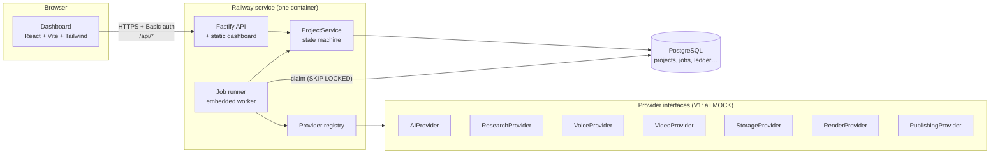
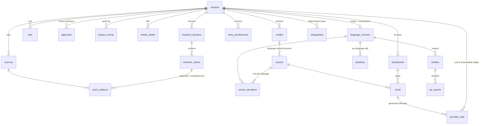
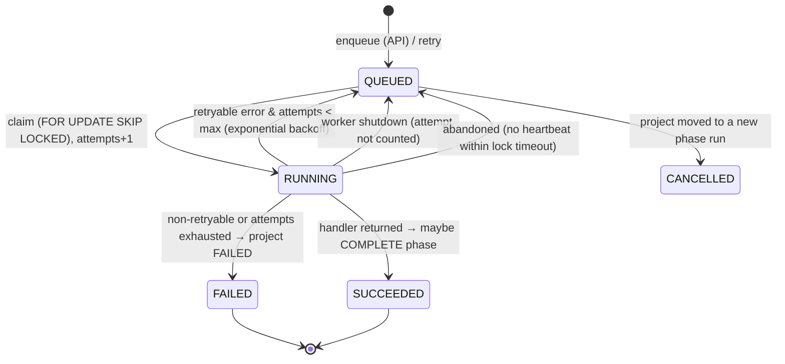

# Architecture — Documentary Engine V1

> Status: **milestone 1 (architecture & scaffold)**. What is real, mocked and
> planned is tracked in [STATUS.md](STATUS.md). Deployment is in
> [DEPLOYMENT.md](DEPLOYMENT.md).

## 1. Principles

1. **A modular monolith, not microservices.** One deployable (API + dashboard +
   embedded worker), one PostgreSQL database. Stages are isolated behind
   interfaces so any of them can later run as its own worker without a rewrite.
2. **The pipeline is data.** Every project status, which jobs run in it, which
   human gate guards it and where it goes next is declared once
   ([`packages/core/src/pipeline.ts`](../packages/core/src/pipeline.ts)).
   Transition rules, the dashboard stage view and the "what can I do next"
   actions are all *derived* from that table.
3. **Vendors are replaceable.** The app depends on seven provider interfaces,
   never on ElevenLabs/Higgsfield/etc. directly. A registry picks the
   implementation from environment variables.
4. **Mock mode is honest.** Everything runs without credentials, and every mock
   output is labelled `MOCK`. Mocks never claim success they did not have: a
   mock publish returns `published: false`, mock research returns URLs on the
   unresolvable `.invalid` domain, the mock LLM refuses to invent structured
   data.
5. **Humans approve.** Five review points (research, script, storyboard,
   generated visuals, final video) cannot be skipped by the state machine.
6. **Multilingual from day one.** A project has a master language and
   `LanguageVersion`s; the schema separates what is shared across languages
   from what is per language.

## 2. System overview



Request path: the dashboard calls the API; the API validates input (zod) and
calls `ProjectService`, which changes state inside a transaction that locks the
project row. Enqueued jobs are rows in `jobs`; the runner claims them, executes
the stage handler with a `StageContext`, records provider calls in the ledger
and reports success/failure back to `ProjectService`, which advances the
project when a phase completes.

## 3. Repository layout and dependency rules

```
apps/
  api/        Fastify server, composition root, worker & seed entry points, esbuild bundle
  web/        Dashboard shell (React 19, Vite 8, Tailwind 4, TanStack Query, React Router 7)
packages/
  core/       Domain: enums, pipeline/state machine, stage derivation, zod contracts, cost math. Browser-safe, no I/O.
  database/   Prisma 7 schema, migrations, client factory, test helpers
  providers/  Provider interfaces, MOCK implementations, registry, reusable contract test suites
  pipeline/   ProjectService (state changes), JobQueue, JobRunner, StageContext, stage handler contract, MOCK stage handlers
modules/      Future home of real stage implementations (research, story, script, voice, visual-director, infographics, editor, qa)
docs/         Architecture, deployment, status
scripts/      release.sh (migrations + seed), test DB init
test/         Shared integration-test setup
```

Allowed dependencies (enforced by package.json declarations):

```
web ─────────────► core
api ──► pipeline ──► providers ──► core
          │  └─────► database  ──► core
          └────────► core
```

`core` imports nothing internal and nothing Node-specific, so the dashboard
shares the exact enums, labels, contracts and response types the API uses.
Only `apps/api/src/container.ts` chooses concrete implementations.

**Why a `pipeline` package rather than one package per stage now?** The stage
*logic* does not exist yet. Each real stage will become `modules/<stage>`
exporting a `StageHandler`, registered in `container.ts` in place of its mock.
Creating eight empty packages today would be ceremony without content.

## 4. Pipeline and state machine

The project `status` is the master pipeline phase (linear, as in the brief,
plus two added review statuses — see §11). Dashboard stages are derived.

| Status | Dashboard stage | Jobs that run here | Leaves by |
|---|---|---|---|
| IDEA | Research (not started) | — | START → RESEARCHING (enqueue RESEARCH) |
| RESEARCHING | Research | RESEARCH | all jobs done → RESEARCH_REVIEW |
| RESEARCH_REVIEW | Research (awaiting approval) | — | **gate RESEARCH**: approve → RESEARCH_COMPLETE, reject → RESEARCHING |
| RESEARCH_COMPLETE | Research ✓ | — | START → STORY_DEVELOPMENT |
| STORY_DEVELOPMENT | Story | STORY | → SCRIPT_DRAFT |
| SCRIPT_DRAFT | Script | SCRIPT | → SCRIPT_REVIEW |
| SCRIPT_REVIEW | Script (awaiting approval) | — | **gate SCRIPT**: approve → SCRIPT_APPROVED, reject → SCRIPT_DRAFT |
| SCRIPT_APPROVED | Script ✓ | — | START → VOICE_GENERATING |
| VOICE_GENERATING | Voice | VOICE | → VOICE_COMPLETE |
| VOICE_COMPLETE | Voice ✓ | — | START → VISUAL_PLANNING |
| VISUAL_PLANNING | Storyboard | VISUAL_PLAN | → STORYBOARD_REVIEW |
| STORYBOARD_REVIEW | Storyboard (awaiting approval) | — | **gate STORYBOARD**: approve → VISUAL_GENERATING, reject → VISUAL_PLANNING |
| VISUAL_GENERATING | Assets | VISUAL_GENERATION, INFOGRAPHIC (parallel) | both done → VISUAL_REVIEW |
| VISUAL_REVIEW | Assets (awaiting approval) | — | **gate VISUAL_ASSETS**: approve → EDITING, reject → VISUAL_GENERATING |
| EDITING | Timeline | EDIT | → RENDERING |
| RENDERING | QA | RENDER | → QA |
| QA | QA (awaiting approval once QA job succeeded) | QA | **gate FINAL_VIDEO** (needs QA job): approve → APPROVED, reject → EDITING |
| APPROVED | Final | PUBLISH | → PUBLISHED, **only with a real (non-mock) publishing provider** |
| PUBLISHED | Final ✓ | — | terminal |
| FAILED | stage where it failed | — | RECOVER (retry the failed job) or REWIND |

Transition kinds: `START`, `COMPLETE`, `APPROVE`, `REJECT`, `FAIL`, `RECOVER`,
`REWIND`. `getTransitionKind(from, to)` is the single authority; anything it
returns `null` for is illegal (e.g. `SCRIPT_REVIEW → VOICE_GENERATING`).

**Phase runs (`phase_seq`).** Each time a project enters a phase, its
`phase_seq` increments and queued jobs from the previous run are cancelled.
Jobs are stamped with the `phase_seq` they were enqueued under; only jobs of the
current run count towards completing a phase. This makes rewinds and
rejections safe: a job that finishes after the project moved on is recorded but
ignored (`JOB_IGNORED_STALE`). Failing and recovering do *not* start a new run,
so already-succeeded sibling jobs (e.g. INFOGRAPHIC when VISUAL_GENERATION
failed) are not thrown away.

## 5. Data model

21 tables. Fields that are filtered/joined/queried are typed columns; creative
payloads still evolving (story beats, shot direction, infographic specs,
timeline tracks, QA findings) are JSONB validated by zod contracts in
`packages/core/src/contracts`. Primary keys are UUIDv7. Timestamps are
`timestamptz`. Money is `numeric(14,6)` USD.



### Core spine (used by milestone 1 code)

| Table | Purpose |
|---|---|
| `projects` | The episode. `status`, `failed_from_status`, `phase_seq`, target length, master language, planning cost estimate. |
| `language_versions` | One per language (`unique(project_id, language)`). Voice config, localized metadata, publishing state. The master is the one matching `projects.master_language`. |
| `jobs` | Units of work *and* the V1 queue: status, attempts/max, `run_after` (backoff), lock owner + heartbeat, `phase_seq`, `is_mock`, input/result/error. |
| `approvals` | Gate, decision (APPROVED/REJECTED/FLAGGED), notes, who, the status at the time, optional FK to the exact artifact version reviewed. |
| `project_events` | Append-only activity log (status changes with reasons, jobs, approvals). |
| `provider_calls` | Every external call: provider, operation, model, mock flag, status, vendor job id, request/response summaries, usage, estimated & actual cost, duration, output asset, shot. |
| `media_assets` | Any stored file (narration, images, clips, infographics, music, SFX, ambience, subtitles, renders). `language_version_id = null` ⇒ shared across languages. Licence/attribution go in `metadata`. |

### Creative artifacts (schema only — no code writes them yet)

| Table | Notes |
|---|---|
| `sources`, `research_dossiers`, `research_claims`, `claim_citations` | A claim has a `verdict` (ESTABLISHED / PROBABLE / DISPUTED / UNVERIFIED / **MYTH**), `confidence`, `claim_type` (DATE, ECONOMIC_FIGURE, …), `needs_verification`, and `popular_version` (what is commonly claimed). Citations link claims to sources with a stance (SUPPORTS / CONTRADICTS / CONTEXT), so "Mackay says X, the notarial archives contradict it" is representable. The brief's `disputed` = `verdict = DISPUTED`; `source_url`/`source_type` live on `sources`; `citation` = source citation + per-claim `locator`. |
| `story_architectures` | Versioned `beats` (hook, context, central question, characters, economic mechanism, escalation, turning point, collapse, consequences, modern relevance, ending). |
| `scripts`, `scenes`, `scene_narrations` | **The script is language-neutral structure; the words are per language.** A scene has a stable `scene_key` ("S01"), tone, visual intent, infographic & sound opportunities. `scene_narrations` holds text, word count, audio asset, duration and word timestamps for one language. |
| `storyboards`, `shots` | Shot type, camera motion, visual type, duration, `direction` JSON (lens, composition, period, characters, props, lighting, colour, action, continuity), provider-neutral `generation_prompt` / `negative_prompt`, selected asset. Generation attempts are `provider_calls` rows with `shot_id`, so a failed shot is retried on its own. |
| `infographics` | Chart type + `spec` (the `InfographicSpec` contract: data, labels, annotations, mandatory source, animation, duration). Rendered deterministically. |
| `timelines`, `renders`, `qa_reports` | Per language. Timeline track contract is defined in the editing milestone. |

### Multilingual

```
MASTER STORY (research, story, script structure, storyboard, shots, maps, charts)  ── shared
      ├── en  narration · subtitles · timeline timing · render · metadata · publishing
      ├── es  …
      └── fr  …
```

Visual assets are stored under `projects/{id}/shared/…`; per-language assets
under `projects/{id}/{lang}/…` (`buildAssetKey`).

## 6. Provider abstractions

| Interface | Methods | Planned implementation |
|---|---|---|
| `AIProvider` | `generateText`, `generateObject(zodSchema)` | Anthropic Claude (`claude-opus-5-5` default) with structured outputs |
| `ResearchProvider` | `search`, `fetchDocument` | Claude server-side web search/fetch, or Exa/Tavily |
| `VoiceProvider` | `getVoices`, `generateNarration` (with timestamps, prev/next text for continuity), `getAudioMetadata` | ElevenLabs |
| `VideoProvider` | `createImage`, `createVideo`, `getGenerationStatus`, `downloadAsset` (+ `waitForGeneration` helper) | Higgsfield |
| `StorageProvider` | `put`, `get`, `head`, `delete`, `list`, `getSignedUrl` | S3-compatible (Cloudflare R2) |
| `RenderProvider` | `renderTimeline`, `renderGraphic`, `getRenderStatus` | FFmpeg (assembly, mixing, loudness) + Remotion (infographics) |
| `PublishingProvider` | `uploadVideo` (privacy defaults to private; synthetic-media disclosure flag), `getPublishStatus` | YouTube Data API |

Every billable method returns `meta: CallMeta` (provider, model, mock flag,
usage items, vendor-reported cost). Stage code calls providers through
`ctx.callProvider(slot, operation, fn)`, which writes the `provider_calls` row,
times the call, prices usage with the provider's rate card and logs it.

**Adding a vendor** = one class implementing the interface + one entry in
`FACTORIES` in `packages/providers/src/registry.ts` + run the matching
`run…Contract()` suite from `packages/providers/src/contract` against it.
Configuring a planned-but-unbuilt provider (e.g. `VOICE_PROVIDER=elevenlabs`)
fails at startup with an explicit "planned but not implemented yet" error.

**Mock behaviour** (all labelled `MOCK`, all $0 but with realistic usage so
cost code is exercised):

- LLM: text is an explicit `[MOCK] … no language model was called` echo;
  structured output only from fixtures registered per task and validated
  against the schema.
- Research: results on `https://mock.invalid/...`.
- Voice: a real WAV (short beep + silence) whose length matches the words at
  150 wpm × speed, with evenly spaced word timestamps — usable for developing
  timeline and subtitle timing without credits.
- Video: async lifecycle simulated across polls; downloads a labelled SVG
  placeholder (`placeholder: true`); never video bytes.
- Storage: in-memory, lost on restart; signed URLs use `mock-storage://`.
- Render: writes a JSON manifest (`<key>.mock.json`) instead of media.
- Publishing: always `published: false`, no id, no URL.
- Any prompt/text containing `MOCK_FAIL` fails, to test retries.

## 7. Job architecture



- **Queue (V1):** the `jobs` table. Workers poll with
  `UPDATE … WHERE id = (SELECT … FOR UPDATE SKIP LOCKED LIMIT 1)`, so any number
  of workers can run without double-processing. All time comparisons use the
  database clock.
- **Runner:** `JobRunner` (N concurrent loops), heartbeat every 30 s while a
  job runs, abandoned-job recovery, exponential backoff (5 s → 5 min cap),
  non-retryable classification (`NonRetryableError`, non-retryable
  `ProviderError`, zod validation errors). On SIGTERM, in-flight jobs are
  returned to the queue without consuming an attempt.
- **Consistency:** job completion and the resulting project transition happen
  in one transaction; a worker that lost its lock cannot overwrite the job.
- **Stage handlers:** `StageHandler { type, mock, run(ctx) }`. Handlers get
  everything via `StageContext` (job, project, language version, db,
  providers, logger, abort signal, `callProvider`). They never construct
  infrastructure, so the same handler runs embedded, in a standalone worker, or
  under a future queue.

**Scaling path (not built, no code changes to stages):**

1. *Now:* worker embedded in the web service (`WORKER_ENABLED=true`).
2. *More throughput / isolation:* a second Railway service from the same image
   running `node apps/api/dist/worker.js`, `WORKER_ENABLED=false` on the web
   service, `WORKER_CONCURRENCY` > 1.
3. *If needed:* implement `JobQueue` with BullMQ/Redis (`notify` pushes the job
   id, `claim` pops ids and claims the row by id). The `jobs` table remains the
   source of truth; runner, handlers, API and dashboard are unchanged.
4. *Fan-out:* per-shot generation as child jobs (a `parent_job_id` column) when
   visual generation is real.

## 8. Observability

- **Structured JSON logs** (pino) with request, project, job, job type,
  attempt, provider, operation, duration, status and error fields. Secrets
  (authorization headers, `*.password|apiKey|secret|token`) are redacted.
  Pretty-printed only in a local terminal.
- **`provider_calls`**: per-call duration, status, error, usage and cost.
- **`project_events`**: the human-readable story of a project (shown in the
  dashboard "Activity" panel).
- **`/api/health`**: database reachability, worker state, version/commit and
  which providers are mocks.

## 9. Security

- Provider credentials are read server-side only (environment variables) and
  never sent to the browser; ledger request summaries never include them.
- HTTP Basic auth over the whole app when `DASHBOARD_PASSWORD` is set;
  **mandatory in production** (startup refuses otherwise) because the
  dashboard can trigger paid generation. Constant-time comparison.
  `/api/health` stays public for Railway's health check.
- All inputs validated with zod; unknown errors return a generic 500 with a
  request id (no stack traces leak).
- Security headers on every response (CSP `default-src 'self'`, `nosniff`,
  `DENY` framing, no referrer).
- Storage keys are validated against traversal; the browser will only ever get
  short-lived signed URLs.
- Runs as the unprivileged `node` user in the container.

## 10. Cost tracking

Providers report usage; `estimateCost(provider, model, usage, rates)` prices
it in integer micro-dollars (no float drift) and returns **unpriced** usage
separately instead of silently counting it as $0 (a warning is logged).
Per call: `estimated_cost_usd` and vendor-reported `actual_cost_usd`. Per
project: `projects.estimated_cost_usd` (planning estimate) and the actual sum
over the ledger (dashboard "Cost" card). Per language version: same ledger,
filtered by `language_version_id`.

## 11. Decisions made in this milestone

| # | Decision | Why | Alternative |
|---|---|---|---|
| D1 | Modular monolith, pnpm workspaces, TypeScript everywhere | One deploy, one language, shared types between API and UI | Separate services (rejected: premature) |
| D2 | Fastify 5 | Fast, typed, mature plugin ecosystem, good logging (pino) | Express (older, slower, weaker types) |
| D3 | Prisma 7 (pinned exactly to 7.10.0) | Readable schema doubles as documentation; first-class SQL migrations (`migrate deploy` as Railway pre-deploy); Prisma 7 has no Rust query engine, so Docker is simple | Drizzle (lighter, but schema is less readable for review). Note: the `prisma` npm `latest` tag currently points to an 8.0 **RC** — do not `pnpm add prisma` without a version. |
| D4 | Postgres as the V1 job queue | Zero extra infrastructure, transactional with state changes, scales to several workers | Redis/BullMQ now (unneeded) |
| D5 | Added `STORYBOARD_REVIEW` status | Storyboard approval must happen **before** paid visual generation; the brief's list only had VISUAL_REVIEW after generation | Approve after generation (wastes credits) |
| D6 | Added `RESEARCH_REVIEW` status | Research is a mandatory approval gate; RESEARCH_COMPLETE now means "approved" | Treat RESEARCH_COMPLETE as the review state |
| D7 | Order EDIT → RENDER → QA (status list order) | Final QA should inspect the rendered file; pre-render checks can be added to the EDIT stage | QA before RENDER (job list order in the brief) |
| D8 | Mock publish never sets PUBLISHED | "Do not fake successful external API calls" | — |
| D9 | Basic auth required in production | The dashboard can spend money once real providers exist | No auth (unsafe on a public Railway URL) |
| D10 | Script = language-neutral scenes; narration per language | Visual timeline, research and assets are reused across languages | One script copy per language |
| D11 | esbuild bundle of the API, npm deps external, build fails if an external import is unresolvable from `apps/api` | Fast startup, no TypeScript at runtime; the check prevents a class of "works locally, crashes on Railway" bugs (it caught one during development) | Running TypeScript with tsx in production |
| D12 | TypeScript 7.0 (native compiler) for type checking | Current stable major; used only for `tsc --noEmit`, runtime uses esbuild/Vite | TS 6.0 (fallback if a tool needs the JS compiler API) |
| D13 | Remotion for infographics, FFmpeg for assembly (planned) | Deterministic React-based graphics; FFmpeg is far faster for 10–15 min assembly and loudness normalisation. **Remotion requires a paid company licence for organisations above its free-use threshold — check before adopting.** | Remotion for the whole edit (slow to render long videos) |
