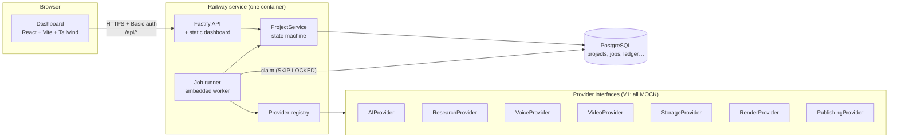
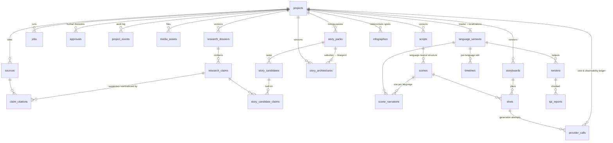
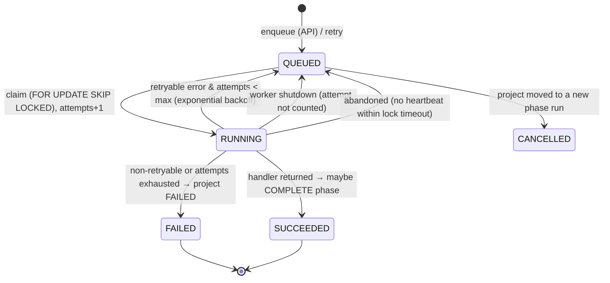

# Architecture — Documentary Engine V1

> Status: **milestone 2 (research engine)** on top of milestone 1
> (architecture & scaffold). What is real, mocked and
> planned is tracked in [STATUS.md](STATUS.md). Deployment is in
> [DEPLOYMENT.md](DEPLOYMENT.md).

## 1. Principles

1. **A modular monolith, not microservices.** One deployable (API + dashboard +
   embedded worker), one PostgreSQL database. Stages are isolated behind
   interfaces so any of them can later run as its own worker without a rewrite.
2. **The pipeline is data.** Every project status, which jobs run in it, which
   human gate guards it and where it goes next is declared once
   ([`packages/core/src/pipeline.ts`](../packages/core/src/pipeline.ts)).
   Transition rules, the dashboard stage view and the "what can I do next"
   actions are all *derived* from that table.
3. **Vendors are replaceable.** The app depends on seven provider interfaces,
   never on ElevenLabs/Higgsfield/etc. directly. A registry picks the
   implementation from environment variables.
4. **Mock mode is honest.** Everything runs without credentials, and every mock
   output is labelled `MOCK`. Mocks never claim success they did not have: a
   mock publish returns `published: false`, mock research returns URLs on the
   unresolvable `.invalid` domain, the mock LLM refuses to invent structured
   data.
5. **Humans approve.** Five review points (research, script, storyboard,
   generated visuals, final video) cannot be skipped by the state machine.
6. **Multilingual from day one.** A project has a master language and
   `LanguageVersion`s; the schema separates what is shared across languages
   from what is per language.

## 2. System overview



Request path: the dashboard calls the API; the API validates input (zod) and
calls `ProjectService`, which changes state inside a transaction that locks the
project row. Enqueued jobs are rows in `jobs`; the runner claims them, executes
the stage handler with a `StageContext`, records provider calls in the ledger
and reports success/failure back to `ProjectService`, which advances the
project when a phase completes.

## 3. Repository layout and dependency rules

```
apps/
  api/        Fastify server, composition root, worker & seed entry points, esbuild bundle
  web/        Dashboard shell (React 19, Vite 8, Tailwind 4, TanStack Query, React Router 7)
packages/
  core/       Domain: enums, pipeline/state machine, stage derivation, zod contracts, cost math. Browser-safe, no I/O.
  database/   Prisma 7 schema, migrations, client factory, test helpers
  providers/  Provider interfaces, MOCK implementations, registry, reusable contract test suites
  pipeline/   ProjectService (state changes), JobQueue, JobRunner, StageContext, stage handler contract, MOCK stage handlers
modules/      Real stage implementations: research (M2), story (M3: mining + architecture); later script, voice, visual-director, infographics, editor, qa
docs/         Architecture, deployment, status
scripts/      release.sh (migrations + seed), test DB init
test/         Shared integration-test setup
```

Allowed dependencies (enforced by package.json declarations):

```
web ─────────────► core
api ──► pipeline ──► providers ──► core
          │  └─────► database  ──► core
          └────────► core
```

`core` imports nothing internal and nothing Node-specific, so the dashboard
shares the exact enums, labels, contracts and response types the API uses.
Only `apps/api/src/container.ts` chooses concrete implementations.

**Why a `pipeline` package rather than one package per stage now?** The stage
*logic* does not exist yet. Each real stage will become `modules/<stage>`
exporting a `StageHandler`, registered in `container.ts` in place of its mock.
Creating eight empty packages today would be ceremony without content.

## 4. Pipeline and state machine

The project `status` is the master pipeline phase (linear, as in the brief,
plus two added review statuses — see §11). Dashboard stages are derived.

| Status | Dashboard stage | Jobs that run here | Leaves by |
|---|---|---|---|
| IDEA | Research (not started) | — | START → RESEARCHING (enqueue RESEARCH) |
| RESEARCHING | Research | RESEARCH | all jobs done → RESEARCH_REVIEW |
| RESEARCH_REVIEW | Research (awaiting approval) | — | **gate RESEARCH**: approve → RESEARCH_COMPLETE, reject → RESEARCHING |
| RESEARCH_COMPLETE | Research ✓ | — | START → STORY_MINING |
| STORY_MINING | Story | STORY_MINING | → STORY_SELECTION |
| STORY_SELECTION | Story (editor curates candidates) | — | START → STORY_ARCHITECTING (enqueue STORY_ARCHITECTURE; needs 5–10 selected units) |
| STORY_ARCHITECTING | Story | STORY_ARCHITECTURE | → STORY_REVIEW |
| STORY_REVIEW | Story (awaiting approval) | — | **gate STORY**: approve → STORY_APPROVED, reject → STORY_SELECTION |
| STORY_APPROVED | Story ✓ | — | START → SCRIPT_DRAFT (never automatic) |
| SCRIPT_DRAFT | Script | SCRIPT | → SCRIPT_REVIEW |
| SCRIPT_REVIEW | Script (awaiting approval) | — | **gate SCRIPT**: approve → SCRIPT_APPROVED, reject → SCRIPT_DRAFT |
| SCRIPT_APPROVED | Script ✓ | — | START → VOICE_GENERATING |
| VOICE_GENERATING | Voice | VOICE | → VOICE_COMPLETE |
| VOICE_COMPLETE | Voice ✓ | — | START → VISUAL_PLANNING |
| VISUAL_PLANNING | Storyboard | VISUAL_PLAN | → STORYBOARD_REVIEW |
| STORYBOARD_REVIEW | Storyboard (awaiting approval) | — | **gate STORYBOARD**: approve → VISUAL_GENERATING, reject → VISUAL_PLANNING |
| VISUAL_GENERATING | Assets | VISUAL_GENERATION, INFOGRAPHIC (parallel) | both done → VISUAL_REVIEW |
| VISUAL_REVIEW | Assets (awaiting approval) | — | **gate VISUAL_ASSETS**: approve → EDITING, reject → VISUAL_GENERATING |
| EDITING | Timeline | EDIT | → RENDERING |
| RENDERING | QA | RENDER | → QA |
| QA | QA (awaiting approval once QA job succeeded) | QA | **gate FINAL_VIDEO** (needs QA job): approve → APPROVED, reject → EDITING |
| APPROVED | Final | PUBLISH | → PUBLISHED, **only with a real (non-mock) publishing provider** |
| PUBLISHED | Final ✓ | — | terminal |
| FAILED | stage where it failed | — | RECOVER (retry the failed job) or REWIND |

Transition kinds: `START`, `COMPLETE`, `APPROVE`, `REJECT`, `FAIL`, `RECOVER`,
`REWIND`. `getTransitionKind(from, to)` is the single authority; anything it
returns `null` for is illegal (e.g. `SCRIPT_REVIEW → VOICE_GENERATING`).

**Phase runs (`phase_seq`).** Each time a project enters a phase, its
`phase_seq` increments and queued jobs from the previous run are cancelled.
Jobs are stamped with the `phase_seq` they were enqueued under; only jobs of the
current run count towards completing a phase. This makes rewinds and
rejections safe: a job that finishes after the project moved on is recorded but
ignored (`JOB_IGNORED_STALE`). Failing and recovering do *not* start a new run,
so already-succeeded sibling jobs (e.g. INFOGRAPHIC when VISUAL_GENERATION
failed) are not thrown away.

## 5. Data model

25 tables. Fields that are filtered/joined/queried are typed columns; creative
payloads still evolving (story sequences, shot direction, infographic specs,
timeline tracks, QA findings) are JSONB validated by zod contracts in
`packages/core/src/contracts`. Primary keys are UUIDv7. Timestamps are
`timestamptz`. Money is `numeric(14,6)` USD.



### Core spine (used by milestone 1 and 2 code)

| Table | Purpose |
|---|---|
| `projects` | The episode. `status`, `failed_from_status`, `phase_seq`, target length, master language, planning cost estimate. |
| `language_versions` | One per language (`unique(project_id, language)`). Voice config, localized metadata, publishing state. The master is the one matching `projects.master_language`. |
| `jobs` | Units of work *and* the V1 queue: status, attempts/max, `run_after` (backoff), lock owner + heartbeat, `phase_seq`, `is_mock`, input/result/error. |
| `approvals` | Gate, decision (APPROVED/REJECTED/FLAGGED), notes, who, the status at the time, optional FK to the exact artifact version reviewed. |
| `project_events` | Append-only activity log (status changes with reasons, jobs, approvals). |
| `provider_calls` | Every external call: provider, operation, model, mock flag, status, vendor job id, request/response summaries, usage, estimated & actual cost, duration, output asset, shot. |
| `media_assets` | Any stored file (narration, images, clips, infographics, music, SFX, ambience, subtitles, renders). `language_version_id = null` ⇒ shared across languages. Licence/attribution go in `metadata`. |
| `sources` | Every source considered for a project, shared across dossier versions (`unique(project_id, normalized_url)`): URL, domain, type (PRIMARY … GENERAL_WEB), author/publisher/date and reliability (from reading the page), retrieval status/error, search snippet and score, `discovered_by` (job, questions, queries; or the failed source an open-access copy stands in for), `duplicate_of_id`. |
| `source_documents` | The retrieved full text of a source (one per source), its sha256, and the cached per-source reading (`analysis`, keyed by `analysis_version` = prompt version + topic/focus hash). |
| `research_dossiers` | Versioned (`unique(project_id, version)`), status DRAFT / IN_REVIEW / APPROVED / REJECTED / SUPERSEDED, `content` (questions, timeline, key figures, price evidence, myths, interpretations, bubble assessment, narrative history, open questions, missing evidence), `quality_report`, `quality_passed`, `stats`, `job_id`. |
| `research_claims`, `claim_citations` | A claim has a stable `claim_key` (C001…), `verdict` (ESTABLISHED / PROBABLE / DISPUTED / UNVERIFIED / **MYTH**), `confidence`, `importance` (KEY / SUPPORTING / BACKGROUND), `claim_type`, `category`, `needs_verification`, `popular_version` (what is commonly claimed) and notes. A citation links a claim to a source with a stance (SUPPORTS / CONTRADICTS / CONTEXT), the verbatim quote, a locator, its `basis` (FULL_TEXT or SNIPPET) and `quote_verified`. |
| `story_packs` | One mining pass over an approved dossier (`unique(project_id, version)`): status, `content` (the AI's proposed selection with premise and rationale, candidates removed and why, candidates carried over, the editor's brief), mining `quality_report`, `stats`, `job_id`. |
| `story_candidates` | A story unit (`candidate_key` S01… in rank order): title, hook, `story_type`, `characters` (JSON: name, kind NAMED_PERSON/GROUP/ROLE, role, claim keys), setting, period, desire, conflict, stakes, escalation, turning point, payoff, why interesting, viewer question, `myth_thread`, `scores` (8 components + appeal + critic rationale), `historical_status` and `historical_confidence` (computed from the claims), `rank_score`, `rank`, caveat notes, `ai_selected` + reason; the editor's `status` (PROPOSED/APPROVED/REJECTED/FLAGGED), `selected`, `priority` (HIGH/NORMAL/LOW), `editor_notes`. |
| `story_candidate_claims` | Candidate ↔ dossier claim (FK, so evidence links cannot dangle). Sources follow from the claims' citations. |
| `story_architectures` | Versioned blueprint (gate STORY): `content` = premise, central question, narrative spine, resolution, sequences (candidate ids/keys, hook, question, key events with claim keys, characters, conflict, escalation, reveal, ending beat, claim keys, derived source ids, caveats, historical status/confidence, duration), unused units with reasons; `pack_id`, `dossier_id`, target and estimated duration, `quality_report`, `stats`, `notes` (the editor's instructions), `job_id`. Approvals link the exact version (`approvals.story_id`). |

### Creative artifacts (schema only — no code writes them yet)

| Table | Notes |
|---|---|
| `scripts`, `scenes`, `scene_narrations` | **The script is language-neutral structure; the words are per language.** A scene has a stable `scene_key` ("S01"), tone, visual intent, infographic & sound opportunities. `scene_narrations` holds text, word count, audio asset, duration and word timestamps for one language. |
| `storyboards`, `shots` | Shot type, camera motion, visual type, duration, `direction` JSON (lens, composition, period, characters, props, lighting, colour, action, continuity), provider-neutral `generation_prompt` / `negative_prompt`, selected asset. Generation attempts are `provider_calls` rows with `shot_id`, so a failed shot is retried on its own. |
| `infographics` | Chart type + `spec` (the `InfographicSpec` contract: data, labels, annotations, mandatory source, animation, duration). Rendered deterministically. |
| `timelines`, `renders`, `qa_reports` | Per language. Timeline track contract is defined in the editing milestone. |

### Multilingual

```
MASTER STORY (research, story, script structure, storyboard, shots, maps, charts)  ── shared
      ├── en  narration · subtitles · timeline timing · render · metadata · publishing
      ├── es  …
      └── fr  …
```

Visual assets are stored under `projects/{id}/shared/…`; per-language assets
under `projects/{id}/{lang}/…` (`buildAssetKey`).

## 6. Provider abstractions

| Interface | Methods | Implementation |
|---|---|---|
| `AIProvider` | `generateText`, `generateObject(zodSchema)` | **Anthropic** (implemented): Claude, `claude-opus-5-5` by default, streaming, structured outputs (JSON schema from zod, re-validated), adaptive thinking with per-task effort, prompt caching of shared system prompts |
| `ResearchProvider` | `search`, `fetchDocuments(urls)` | **Tavily** (implemented): `/search` + `/extract` (full text as markdown, batches of 20). Planned alternatives: Exa, Claude server-side web search |
| `VoiceProvider` | `getVoices`, `generateNarration` (with timestamps, prev/next text for continuity), `getAudioMetadata` | ElevenLabs |
| `VideoProvider` | `createImage`, `createVideo`, `getGenerationStatus`, `downloadAsset` (+ `waitForGeneration` helper) | Higgsfield |
| `StorageProvider` | `put`, `get`, `head`, `delete`, `list`, `getSignedUrl` | S3-compatible (Cloudflare R2) |
| `RenderProvider` | `renderTimeline`, `renderGraphic`, `getRenderStatus` | FFmpeg (assembly, mixing, loudness) + Remotion (infographics) |
| `PublishingProvider` | `uploadVideo` (privacy defaults to private; synthetic-media disclosure flag), `getPublishStatus` | YouTube Data API |

Every billable method returns `meta: CallMeta` (provider, model, mock flag,
usage items, vendor-reported cost). Stage code calls providers through
`ctx.callProvider(slot, operation, fn)`, which writes the `provider_calls` row,
times the call, prices usage with the provider's rate card and logs it.

**Adding a vendor** = one class implementing the interface + one entry in
`FACTORIES` in `packages/providers/src/registry.ts` + run the matching
`run…Contract()` suite from `packages/providers/src/contract` against it.
Configuring a planned-but-unbuilt provider (e.g. `VOICE_PROVIDER=elevenlabs`)
fails at startup with an explicit "planned but not implemented yet" error.

**Mock behaviour** (all labelled `MOCK`, all $0 but with realistic usage so
cost code is exercised):

- LLM: text is an explicit `[MOCK] … no language model was called` echo;
  structured output only from fixtures registered per task and validated
  against the schema.
- Research: results on `https://mock.invalid/...`.
- Voice: a real WAV (short beep + silence) whose length matches the words at
  150 wpm × speed, with evenly spaced word timestamps — usable for developing
  timeline and subtitle timing without credits.
- Video: async lifecycle simulated across polls; downloads a labelled SVG
  placeholder (`placeholder: true`); never video bytes.
- Storage: in-memory, lost on restart; signed URLs use `mock-storage://`.
- Render: writes a JSON manifest (`<key>.mock.json`) instead of media.
- Publishing: always `published: false`, no id, no URL.
- Any prompt/text containing `MOCK_FAIL` fails, to test retries.

## 7. Job architecture



- **Queue (V1):** the `jobs` table. Workers poll with
  `UPDATE … WHERE id = (SELECT … FOR UPDATE SKIP LOCKED LIMIT 1)`, so any number
  of workers can run without double-processing. All time comparisons use the
  database clock.
- **Runner:** `JobRunner` (N concurrent loops), heartbeat every 30 s while a
  job runs, abandoned-job recovery, exponential backoff (5 s → 5 min cap),
  non-retryable classification (`NonRetryableError`, non-retryable
  `ProviderError`, zod validation errors). On SIGTERM, in-flight jobs are
  returned to the queue without consuming an attempt.
- **Consistency:** job completion and the resulting project transition happen
  in one transaction; a worker that lost its lock cannot overwrite the job.
- **Stage handlers:** `StageHandler { type, mock, run(ctx) }`. Handlers get
  everything via `StageContext` (job, project, language version, db,
  providers, logger, abort signal, `callProvider`). They never construct
  infrastructure, so the same handler runs embedded, in a standalone worker, or
  under a future queue.

**Scaling path (not built, no code changes to stages):**

1. *Now:* worker embedded in the web service (`WORKER_ENABLED=true`).
2. *More throughput / isolation:* a second Railway service from the same image
   running `node apps/api/dist/worker.js`, `WORKER_ENABLED=false` on the web
   service, `WORKER_CONCURRENCY` > 1.
3. *If needed:* implement `JobQueue` with BullMQ/Redis (`notify` pushes the job
   id, `claim` pops ids and claims the row by id). The `jobs` table remains the
   source of truth; runner, handlers, API and dashboard are unchanged.
4. *Fan-out:* per-shot generation as child jobs (a `parent_job_id` column) when
   visual generation is real.

## 8. Observability

- **Structured JSON logs** (pino) with request, project, job, job type,
  attempt, provider, operation, duration, status and error fields. Secrets
  (authorization headers, `*.password|apiKey|secret|token`) are redacted.
  Pretty-printed only in a local terminal.
- **`provider_calls`**: per-call duration, status, error, usage and cost.
- **`project_events`**: the human-readable story of a project (shown in the
  dashboard "Activity" panel).
- **`/api/health`**: database reachability, worker state, version/commit and
  which providers are mocks.

## 9. Security

- Provider credentials are read server-side only (environment variables) and
  never sent to the browser; ledger request summaries never include them.
- HTTP Basic auth over the whole app when `DASHBOARD_PASSWORD` is set;
  **mandatory in production** (startup refuses otherwise) because the
  dashboard can trigger paid generation. Constant-time comparison.
  `/api/health` stays public for Railway's health check.
- All inputs validated with zod; unknown errors return a generic 500 with a
  request id (no stack traces leak).
- Security headers on every response (CSP `default-src 'self'`, `nosniff`,
  `DENY` framing, no referrer).
- Storage keys are validated against traversal; the browser will only ever get
  short-lived signed URLs.
- Runs as the unprivileged `node` user in the container.

## 10. Cost tracking

Providers report usage; `estimateCost(provider, model, usage, rates)` prices
it in integer micro-dollars (no float drift) and returns **unpriced** usage
separately instead of silently counting it as $0 (a warning is logged).
Per call: `estimated_cost_usd` and vendor-reported `actual_cost_usd`. Per
project: `projects.estimated_cost_usd` (planning estimate) and the actual sum
over the ledger (dashboard "Cost" card). Per language version: same ledger,
filtered by `language_version_id`.

Cost basis per ledger row (`provider_calls.cost_basis`):

| Basis | Meaning |
|---|---|
| `VENDOR_REPORTED` | The provider returned a dollar cost (`actual_cost_usd`). |
| `ESTIMATED` | Usage reported by the provider × configured price (`estimated_cost_usd`): Anthropic tokens × the served model's published per-token prices; Tavily credits × `TAVILY_USD_PER_CREDIT`. Labelled "estimated" in the dashboard. |
| `UNPRICED` | Usage without a configured price (counted in "unpriced calls", never as $0). |
| `MOCK` | Mock provider, $0. |

Failed calls keep the usage the provider reported (a refused or truncated
Claude response still costs tokens).

## 11. Research engine (milestone 2)

`modules/research` implements the RESEARCH stage. It talks only to the
`AIProvider` and `ResearchProvider` interfaces: Tavily discovers and
retrieves; Claude plans, judges sources, reads and synthesises; deterministic
code verifies.

```
plan ─▶ discover ─▶ triage ─▶ retrieve ─▶ read ─▶ synthesise ─▶ normalise ─▶ review ─▶ normalise ─▶ quality gate ─▶ persist vN
Claude   Tavily      Claude    Tavily      Claude   Claude        code          Claude    code          code             Postgres
```

1. **Plan** — up to 12 research questions (each with ≤ 4 search queries)
   from the topic, 12 generic focus areas (what happened, chronology, the
   traded thing and its rarity, context, participants, trading mechanisms,
   price evidence and where famous numbers come from, famous anecdotes,
   collapse, consequences, historians' disputes and whether "bubble" is
   deserved, the later narrative) and the project's research brief.
2. **Discover** — every query is searched (advanced depth, scholarly, book,
   archive and reputable-press domains *preferred*, social media and
   document-sharing sites *excluded*); results are deduplicated by
   normalised URL and given a domain-based type hint.
3. **Triage** — Claude selects up to 45 sources for full-text retrieval,
   favouring the source hierarchy (primary > academic > books > archives /
   museums / universities > reputable secondary > general web). Guardrails in
   code: at most 3 per domain; every question keeps ≥ 2 candidates.
4. **Retrieve** — full text via `fetchDocuments`. Pages under 600 characters
   (paywalls, stubs) count as failures. For high-tier works that failed
   (JSTOR, publisher sites usually refuse), one search looks for an
   **open-access copy**; a copy is accepted only if it is the same work
   (all words of a short title, ≥ 80% of a longer title, journal context for
   one- or two-word titles) and is retrievable; it becomes its own source,
   and the original stays FAILED with a pointer to it. Identical or
   near-identical texts (8-word-shingle Jaccard ≥ 0.85) are marked
   `duplicate_of` the stronger source and not read twice.
5. **Read** — Claude reads each document (long ones are cut to their
   most topic-relevant passages, never rewritten) and returns an assessment
   (real source type, author, date, reliability, whether it repeats popular
   myths) and evidence items, each with a **verbatim quote**. Code then
   checks every quote against the stored text (normalised for markdown,
   typographic quotes/dashes and whitespace; elided quotes must appear in
   order); unverifiable evidence is discarded and counted. Readings are cached
   per document.
6. **Synthesise** — from verified evidence only (grouped by focus area,
   with source types and reliability), Claude writes the claims and dossier
   sections. Verdict definitions are fixed in the prompt; MYTH requires
   contradicting evidence and a `popularVersion`; both sides of a conflict
   are cited.
7. **Normalise** (deterministic, applied before and after review; each change
   is recorded in the quality report): citations move off duplicates and off
   anything unverified or not retrieved; a MYTH without counter-evidence
   becomes UNVERIFIED; any claim left without citations becomes UNVERIFIED;
   ESTABLISHED/PROBABLE with only contradicting evidence becomes DISPUTED;
   ESTABLISHED contradicted by a tier-1/2 source becomes DISPUTED; ESTABLISHED
   needs two independent sources or one high-tier source, else PROBABLE;
   DISPUTED and UNVERIFIED are always flagged for verification.
8. **Review** — Claude checks the dossier for incoherence (verdicts not
   matching their evidence, contradictory claims, missing disputes). Fixes
   are limited to: set verdict, set confidence, flag for verification, remove
   claim; every issue and its resolution is stored.
9. **Quality gate** — pure function over the dossier
   (`computeQualityReport`): claim count, key claims, cited-source count,
   high-tier sources, source-type and domain diversity, general-web share,
   citations on every non-UNVERIFIED claim, no key claim resting on a
   snippet, all quotes verified, disputes and unverified claims flagged,
   myths with popular version and counter-evidence, valid retrieved URLs,
   duplicates merged, coherence, every question answered. FAIL on any check
   ⇒ the dossier is saved as DRAFT, the job fails without automatic retry
   and the project goes to FAILED (rewind to research again). PASS ⇒ the
   dossier is IN_REVIEW and the project waits at RESEARCH_REVIEW. **Nothing is
   ever auto-approved.**
10. **Persist** — one transaction: earlier DRAFT/IN_REVIEW versions become
    SUPERSEDED, the new version is written with its claims and citations.
    The approval decision is linked to the exact dossier it judged
    (`approvals.dossier_id`) and sets that dossier APPROVED/REJECTED.

Cost and safety: every provider call goes through the ledger; the run stops
(non-retryable) once its recorded spend passes `RESEARCH_MAX_COST_USD`,
checked between phases and before every uncached read. Progress messages
appear in the project activity log.

**Saved progress.** Each completed paid step (plan, discovered candidates,
triage selection, retrieval, synthesis, review) is written to
`jobs.checkpoint`. A retry (automatic, or a manual Retry, which copies the
failed job's checkpoint to the new job) replays the saved steps in order and
runs only what is missing; a step is reused only if every step before it was,
and saved model outputs are re-validated against their schemas. Readings need
no entry: they are cached per stored document. The checkpoint is cleared when
a dossier passes the gate. A new version (rewind and research again) starts a
fresh plan but still re-fetches only failed URLs and re-reads only new
documents.

**Text hygiene.** NUL and other control characters (common in text extracted
from PDFs; PostgreSQL rejects NUL) are removed at the provider boundary and
again before anything is stored or shown to a model. A document the database
still refuses fails only that source.

**Schema fallback.** Structured outputs compile the JSON schema into a
grammar, and the API refuses grammars over an unpublished size limit (the
synthesis schema hit it on the first live run). The Anthropic provider then
repeats the request with the schema in the system prompt and validates the
answer against the same zod schema.

## 12. Story engine (milestone 3)

`modules/story` turns an **approved** research dossier into story units and
then into a documentary blueprint. It writes no script. Everything it says
traces to dossier claims, and every gate result is advisory: a human approves.

```
STORY_MINING:   mine (Claude) → evidence rules → critic (support + 8 scores)
                → [top-up mine + rules + critic if < 15 left] → rank
                → proposed selection (5–10) → mining gate → story pack vN
STORY_SELECTION (editor): approve / reject / flag, select, prioritise, notes,
                another mining pass with a brief
STORY_ARCHITECTURE: architect (Claude) → evidence rules → reviewer (may
                return a corrected version) → evidence rules → architecture
                gate → story architecture vN → STORY_REVIEW (human gate)
```

**Evidence rules** (`rules.ts`, `mining.ts`, `architecture.ts`; deterministic,
unit-tested). Claim keys must exist in the dossier. A named person must appear
in the evidence of the cited claims; if the dossier names them elsewhere, that
claim is linked (traceability), otherwise the candidate is removed (or, for a
side character, the character is dropped). Every figure (except years, which
need only appear in the dossier) must be in the cited evidence; a figure found
in another claim links that claim (one link, firmest verdict first, so a myth
or dispute is only pulled in when nothing firmer has the fact), a figure found
nowhere removes the candidate. A candidate using a MYTH claim must tell it as a
myth investigation (popular story → origin → who spread it → what happened →
why it survived). Candidates without a traceable source (a retrieved source with
a verified quote), without characters or an arc, duplicating another (claim-set
Jaccard, title overlap) or resembling one the editor rejected are removed —
each with its reason, kept in the pack for the editor to see.

**Historical status and confidence** are computed, never chosen by a model:
status from the weakest verdict (MYTH → myth investigation, DISPUTED →
contested, UNVERIFIED → uncertain, PROBABLE, ESTABLISHED); confidence 0–10 from
verdict strength × claim confidence, 60% mean / 40% weakest, discounted when
only one or two sources stand behind the story.

**Ranking** (`packages/core/src/story.ts`). The critic scores intrigue (0.20),
human drama (0.15), surprise (0.13), stakes (0.12), visual potential (0.12),
escalation (0.10), emotional weight (0.10) and economic significance (0.08),
0–10 each; appeal is the weighted sum. Rank score = appeal × (0.55 + 0.45 ×
confidence/10), so a sensational but weakly supported story does not
automatically beat a fascinating, well-supported one. The dashboard shows the
components, weights and the formula for every candidate.

**Story evidence vs background (architecture).** A sequence's story evidence
(`claimKeys`) is the selected units' own claims and nothing else: every key
event cites only those claims, every sequence tells at least one selected unit,
and every person, figure and date must come from the selected units' evidence
(a figure or person found in another selected unit's claim links that claim;
years count as figures here). Other claims of the approved dossier may appear
only as `contextClaims` — background with a stated purpose, their own derived
`contextSourceIds`, caveats when disputed — and cannot add a story, person,
event, figure, date or beat. The code checks this deterministically for
claims, events, figures and dates, for listed characters, and for the
dossier's key figures mentioned in the telling; whether prose smuggles in an
unnamed event is left to the reviewer and the editor. The architect sees the
units' claims as story evidence and the rest of the dossier only as a
one-line-per-claim background list.

**Editorial control.** The AI's selection is a proposal (`ai_selected`); the
editor's `selected`, `status`, `priority` and notes are what the architect
gets. HIGH priority must be used (gate check); the architect must explain any
selected unit it leaves out. Candidates can only be changed in STORY_SELECTION
on the current pack. Another mining pass (from any later story status) rewinds
to STORY_MINING and enqueues the job in one transaction; approved and flagged
candidates are carried into the new pack, rejected ones are not proposed again.
Rejecting an architecture returns to STORY_SELECTION; the next version is
built with the rejection notes and the previous outline.

**Gates.** Mining: 15–30 candidates (fewer than 10 fails), evidence links,
traceable sources, named people and figures in the cited evidence, historical
status consistent with the verdicts, myth framing, no duplicates, complete
scores, story structure, variety, share of well-supported candidates, a 5–10
proposal. Architecture: central question, premise/spine, 3–12 sequences, every
sequence and key event cites claims, story evidence only from the selected
units' claims, every sequence tells a selected unit, other claims only as
labelled background (a warning if background outweighs story evidence),
sources derivable from the claims (story and background separately), HIGH
priority used, every disputed/unverified/myth claim used (story or background)
has a caveat (how the narration must present it), no invented or outside
people, figures and dates from the selected units' evidence, story rather than
a list of facts, runtime
within the project's range (±20% warns, beyond fails), sequence durations
consistent with their structure, no unresolved critical review issue. A failed
gate saves the artifact as DRAFT for inspection and fails the job without
retry; its saved progress is kept, so a retry re-evaluates without new model
calls.

**Cost control.** Each step's raw model output is saved in `jobs.checkpoint`
(`StepCheckpoint`); retries reuse completed steps. Every call goes through the
provider ledger (model, tokens, estimated cost, duration, failures); a job
stops once its recorded spend passes `STORY_MAX_COST_USD` (default $15). Typical
calls: mining 3–6 (mine, critic, selection; top-up only when needed),
architecture 2 (architect, reviewer).

## 13. Decisions

| # | Decision | Why | Alternative |
|---|---|---|---|
| D1 | Modular monolith, pnpm workspaces, TypeScript everywhere | One deploy, one language, shared types between API and UI | Separate services (rejected: premature) |
| D2 | Fastify 5 | Fast, typed, mature plugin ecosystem, good logging (pino) | Express (older, slower, weaker types) |
| D3 | Prisma 7 (pinned exactly to 7.10.0) | Readable schema doubles as documentation; first-class SQL migrations (`migrate deploy` as Railway pre-deploy); Prisma 7 has no Rust query engine, so Docker is simple | Drizzle (lighter, but schema is less readable for review). Note: the `prisma` npm `latest` tag currently points to an 8.0 **RC** — do not `pnpm add prisma` without a version. |
| D4 | Postgres as the V1 job queue | Zero extra infrastructure, transactional with state changes, scales to several workers | Redis/BullMQ now (unneeded) |
| D5 | Added `STORYBOARD_REVIEW` status | Storyboard approval must happen **before** paid visual generation; the brief's list only had VISUAL_REVIEW after generation | Approve after generation (wastes credits) |
| D6 | Added `RESEARCH_REVIEW` status | Research is a mandatory approval gate; RESEARCH_COMPLETE now means "approved" | Treat RESEARCH_COMPLETE as the review state |
| D7 | Order EDIT → RENDER → QA (status list order) | Final QA should inspect the rendered file; pre-render checks can be added to the EDIT stage | QA before RENDER (job list order in the brief) |
| D8 | Mock publish never sets PUBLISHED | "Do not fake successful external API calls" | — |
| D9 | Basic auth required in production | The dashboard can spend money once real providers exist | No auth (unsafe on a public Railway URL) |
| D10 | Script = language-neutral scenes; narration per language | Visual timeline, research and assets are reused across languages | One script copy per language |
| D11 | esbuild bundle of the API, npm deps external, build fails if an external import is unresolvable from `apps/api` | Fast startup, no TypeScript at runtime; the check prevents a class of "works locally, crashes on Railway" bugs (it caught one during development) | Running TypeScript with tsx in production |
| D12 | TypeScript 7.0 (native compiler) for type checking | Current stable major; used only for `tsc --noEmit`, runtime uses esbuild/Vite | TS 6.0 (fallback if a tool needs the JS compiler API) |
| D13 | Remotion for infographics, FFmpeg for assembly (planned) | Deterministic React-based graphics; FFmpeg is far faster for 10–15 min assembly and loudness normalisation. **Remotion requires a paid company licence for organisations above its free-use threshold — check before adopting.** | Remotion for the whole edit (slow to render long videos) |
| D14 | Tavily is the primary `ResearchProvider`; the stage depends only on the interface | Tavily returns full page text (`/extract`) as well as search results, which verbatim quote checking needs; Claude does all judgement | Claude server-side web search/fetch (planned alternative), Exa |
| D15 | Evidence = verbatim quote from retrieved full text, verified by code | A model can misquote; a quote that is not in the document is discarded, so every stored citation is checkable. Snippet-only evidence never reaches a claim | Trusting model-extracted facts |
| D16 | Deterministic verdict rules after the model's synthesis | The source hierarchy and "a myth needs counter-evidence" are policy, not model judgement; every change is recorded | Prompt-only rules |
| D17 | Quality-gate failure = non-retryable job failure, dossier kept as DRAFT, project FAILED | A failed gate needs a human decision (rewind, brief, thresholds), not a silent re-run that spends again | Automatic retries |
| D18 | Added source type `GENERAL_WEB`, distinct from `GENERAL_REFERENCE` | Encyclopedias and SEO pages are different evidence; the gate limits the general-web share | One "general" bucket |
| D19 | One model (`AI_MODEL`, default `claude-opus-5-5`) for every research task, with per-task effort (plan/synthesis/review high, triage/reading medium) | Reading decides which quotes exist at all; quality there matters most. A cheaper model for reading is a cost lever to evaluate with real runs | Haiku/Sonnet for reading |
| D20 | Anthropic server-side refusal fallback enabled (`fallbacks: "default"`) | A safety-classifier false positive on historical material would otherwise fail a read; the served model is recorded and priced | Fail the call |
| D21 | Costs from usage × configured prices, labelled ESTIMATED | Neither Anthropic nor Tavily returns dollars per call; inventing "actual" costs is not allowed | — |
| D22 | Open-access copy for unretrievable scholarly works, strict same-work matching | Without it JSTOR/publisher refusals push the dossier toward popular sources; a wrong "copy" would misattribute words, so matching is conservative and the reader is told to confirm | Use the abstract/snippet (not allowed for key claims) |
| D23 | Sources, retrieved texts and readings are shared across dossier versions | A retry or v2 re-fetches only failures and re-reads only new documents | Re-research from scratch each version |
| D24 | Retries resume from saved progress (`jobs.checkpoint`) | The first live run re-paid the plan, 48 searches and triage on each automatic retry after a deterministic failure; resuming makes a retry cost only the step that failed | Fewer automatic retries (still wastes the first repeat) |
| D25 | Schema-in-instructions fallback when structured outputs reject a schema as too complex | The compile limit is unpublished; a fallback with the same validation avoids guessing a schema shape that fits | Redesigning the synthesis schema blind; splitting synthesis into several calls (more input tokens) |
| D26 | Railway settings live on the service, not in `railway.json` | Railway deprecated Config as Code; new services cannot read it, and its GitHub import splits pnpm monorepos into per-package services | Railway IaC (`.railway/railway.ts`), applied with the Railway CLI — possible later |
| D27 | Story mining and architecture are two jobs with a human curation status (STORY_SELECTION) between them, and a human gate (STORY) after | The AI proposes; the editor decides what goes in before any architecture work is paid for, and approves the blueprint | One STORY job that picks the units itself |
| D28 | Historical status/confidence computed from the linked claims' verdicts; the critic scores appeal only | Trust must come from the evidence the research gate already judged, not from a model's impression; scoring appeal separately makes the ranking formula explicit | Model-assigned confidence |
| D29 | Evidence rules remove a candidate rather than letting it through with a warning; a top-up pass replaces removals | An invented person or figure must never reach the editor's shortlist; the removal reasons are shown and fed to the top-up prompt | Flag and keep |
| D30 | Candidate ↔ claim links are rows (`story_candidate_claims`); architecture sequences keep claim keys in JSON with sources derived and re-checked by the gate | FK links make candidate evidence impossible to dangle; sequences are a blueprint whose shape will change with the script stage, and the dossier version is fixed per architecture | A join table per sequence |
| D31 | A reviewer's corrected architecture is kept only if it has no more evidence problems than the draft | A revision can fix framing but can also introduce new unsupported material; the deterministic count decides | Always trust the revision |
| D32 | Architecture story evidence = the selected units' own claims; other dossier claims only as labelled background (`contextClaims` with a purpose), never adding a story, person, event, figure, date or beat | The editor's selection must define the film; background can explain but not extend it. Kept checkable: separate keys and sources, deterministic gate checks | Any approved-dossier claim as evidence (the first version) |
